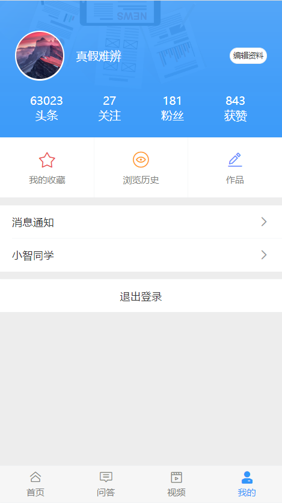

# 三、个人中心


## 准备

### TabBar 处理

通过分析页面，我们可以看到，首页、问答、视频、我的 都使用的是同一个底部标签栏，我们没必要在每个页面中都写一个，所以为了通用方便，我们可以使用 Vue Router 的嵌套路由来处理。

- 父路由：一个空页面，包含一个 tabbar，中间留子路由出口
- 子路由
  - 首页
  - 问答
  - 视频
  - 我的

一、创建 tabbar 组件并配置路由


这里主要使用到的 Vant 组件：

- [Tabbar 标签栏](https://youzan.github.io/vant/#/zh-CN/tabbar)

1、创建 `src/views/tabbar/index.vue`

```html
<template>
  <div class="tab-bar">
    <!-- 子路由出口 -->
    <router-view />
    <van-tabbar v-model="active" route>
      <van-tabbar-item icon="wap-home-o" to="/">首页</van-tabbar-item>
      <van-tabbar-item icon="comment-o" to="/qa">问答</van-tabbar-item>
      <van-tabbar-item icon="video-o" to="/video">视频</van-tabbar-item>
      <van-tabbar-item icon="user-o" to="/my">我的</van-tabbar-item>
    </van-tabbar>
  </div>
</template>

<script>
export default {
  name: 'TabBar',
  components: {},
  props: {},
  data () {
    return {
      active: 0
    }
  },
  computed: {},
  watch: {},
  created () {},
  mounted () {},
  methods: {}
}
</script>

<style scoped lang="less"></style>

```

2、然后将 tab-bar 组件配置到一级路由

```js
{
  path: '/',
  component: () => import('@/views/tabbar')
}
```

访问 `/` 测试。

二、分别创建首页、问答、视频、我的页面组件

首页组件：

```html
<template>
  <div class="home-container">首页</div>
</template>

<script>
export default {
  name: 'HomePage',
  components: {},
  props: {},
  data () {
    return {}
  },
  computed: {},
  watch: {},
  created () {},
  mounted () {},
  methods: {}
}
</script>

<style scoped></style>

```


问答组件：

```html
<template>
  <div class="qa-container">问答</div>
</template>

<script>
export default {
  name: 'QaPage',
  components: {},
  props: {},
  data () {
    return {}
  },
  computed: {},
  watch: {},
  created () {},
  mounted () {},
  methods: {}
}
</script>

<style scoped></style>

```


视频组件：

```html
<template>
  <div class="video-container">首页</div>
</template>

<script>
export default {
  name: 'VideoPage',
  components: {},
  props: {},
  data () {
    return {}
  },
  computed: {},
  watch: {},
  created () {},
  mounted () {},
  methods: {}
}
</script>

<style scoped></style>

```


我的组件：

```html
<template>
  <div class="my-container">首页</div>
</template>

<script>
export default {
  name: 'MyPage',
  components: {},
  props: {},
  data () {
    return {}
  },
  computed: {},
  watch: {},
  created () {},
  mounted () {},
  methods: {}
}
</script>

<style scoped></style>

```


二、将四个主页面配置为 tab-bar 的子路由

```js
{
  path: '/',
  name: 'tab-bar',
  component: () => import('@/views/tab-bar'),
  children: [
    {
      path: '', // 默认子路由
      name: 'home',
      component: () => import('@/views/home')
    },
    {
      path: 'qa',
      name: 'qa',
      component: () => import('@/views/qa')
    },
    {
      path: 'video',
      name: 'video',
      component: () => import('@/views/video')
    },
    {
      path: 'my',
      name: 'my',
      component: () => import('@/views/my')
    }
  ]
}
```

最后测试。


### 页面布局

```html
<template>
  <div class="my-container">
    <div class="header">
      <div class="nav-bar"></div>
      <div class="author-info">
        <van-image
          class="avatar"
          round
          fit="cover"
          src="https://img.yzcdn.cn/vant/cat.jpeg"
        />
        <div class="name-wrap">
          <div class="name">黑马头条号</div>
          <van-button class="renzheng" size="mini" round>申请认证</van-button>
        </div>
        <div class="read-statistic">
          <i class="toutiao toutiao-yuedu"></i>
          <div class="info">
            <div>今日阅读</div>
            <div>5分钟</div>
          </div>
        </div>
      </div>
      <div class="meta-info">
        <div class="item">
          <div class="count">8</div>
          <div class="title">收藏</div>
        </div>
        <div class="item">
          <div class="count">8</div>
          <div class="title">收藏</div>
        </div>
        <div class="item">
          <div class="count">8</div>
          <div class="title">收藏</div>
        </div>
        <div class="item">
          <div class="count">8</div>
          <div class="title">收藏</div>
        </div>
      </div>
      <!-- <van-grid class="meta-info" :column-num="3">
        <van-grid-item icon="shoucang" icon-prefix="toutiao" text="收藏" />
        <van-grid-item icon="lishi" icon-prefix="toutiao" text="历史" />
        <van-grid-item icon="zuopin" icon-prefix="toutiao" text="作品" />
      </van-grid> -->
    </div>
  </div>
</template>

<script>
export default {
  name: 'MyIndex',
  components: {},
  props: {},
  data () {
    return {}
  },
  computed: {},
  watch: {},
  created () {},
  mounted () {},
  methods: {}
}
</script>

<style scoped lang="less">
.header {
  background-image: url("~@/assets/banner.png");
  background-size: cover;

  .nav-bar {
    height: 53px;
  }

  .author-info {
    // height: 178px;
    // background-color: pink;
    padding-top: 23px;
    padding-bottom: 23px;
    padding-left: 40px;
    display: flex;
    align-items: center;
    .avatar {
      box-sizing: border-box;
      width: 132px;
      height: 132px;
      border: 4px solid #fff;
      margin-right: 31px;
    }
    .name-wrap {
      .name {
        font-size: 30px;
        color: #fff;
      }
      .renzheng {
        width: 116px;
        height: 32px;
        line-height: 30px;
        font-size: 20px;
        color: #3296fa;
      }
    }
    .read-statistic {
      box-sizing: border-box;
      position: absolute;
      right: 0;
      width: 188px;
      height: 80px;
      background-color: #000;
      background-color: rgba(0, 0, 0, 0.2);
      border-radius: 40px 0 0 40px;
      padding: 16px 24px;
      display: flex;
      align-items: center;
      .toutiao {
        color: #fff;
        font-size: 34px;
        z-index: 3;
        margin-right: 17px;
      }
      .info {
        font-size: 22px;
        color: #fff;
      }
    }
  }

  .meta-info {
    height: 130px;
    display: flex;
    color: #fff;
    .item {
      flex: 1;
      display: flex;
      flex-direction: column;
      justify-content: center;
      align-items: center;
      .count {
        font-size: 36px;
      }
      .title {
        font-size: 23px;
      }
    }
  }
}
</style>

```


- 把资料素材中的两个图片放到个人中心组件目录中
  - banner.png
  - mobile.png

```html
<template>
  <div class="my-container">
    <!-- 已登录：用户信息 -->
    <div class="user-info-wrap">
      <div class="base-info-wrap">
        <div class="avatar-title-wrap">
          <van-image
            class="avatar"
            round
            fit="cover"
            src="https://img.yzcdn.cn/vant/cat.jpeg"
          />
          <div class="title">黑马程序员</div>
        </div>
        <van-button round size="mini">编辑资料</van-button>
      </div>
      <van-grid class="data-info" :border="false">
        <van-grid-item>
          <span class="count">123</span>
          <span class="text">头条</span>
        </van-grid-item>
        <van-grid-item>
          <span class="count">123</span>
          <span class="text">关注</span>
        </van-grid-item>
        <van-grid-item>
          <span class="count">123</span>
          <span class="text">粉丝</span>
        </van-grid-item>
        <van-grid-item>
          <span class="count">123</span>
          <span class="text">获赞</span>
        </van-grid-item>
      </van-grid>
    </div>
    <!-- /已登录：用户信息 -->

    <!-- 未登录 -->
    <div class="not-login">
      <div class="mobile"></div>
      <div class="text">点击登录</div>
    </div>
    <!-- /未登录 -->

    <!-- 其它 -->
    <van-grid clickable :column-num="2">
      <van-grid-item text="收藏">
        <van-icon slot="icon" name="star-o" color="#eb5253" />
      </van-grid-item>
      <van-grid-item text="历史">
        <van-icon slot="icon" name="browsing-history-o" color="#ffa023" />
      </van-grid-item>
    </van-grid>

    <van-cell-group :border="false">
      <van-cell title="消息通知" is-link />
      <van-cell title="小智同学" is-link />
    </van-cell-group>

    <van-cell-group>
      <van-cell
        style="text-align: center;"
        title="退出登录"
        clickable
      />
    </van-cell-group>
    <!-- /其它 -->
  </div>
</template>

<script>
export default {
  name: 'MyPage',
  components: {},
  props: {},
  data () {
    return {}
  },
  computed: {},
  watch: {},
  created () {},
  mounted () {},
  methods: {}
}
</script>

<style lang="less" scoped>
.my-container {
  .user-info-wrap {
    background: url("./banner.png") no-repeat;
    height: 364px;
    box-sizing: border-box;
    background-size: cover;
    padding: 80px 40px;
    font-size: 30px;
    color: #fff;
    .base-info-wrap {
      display: flex;
      justify-content: space-between;
      align-items: center;
      .avatar-title-wrap {
        display: flex;
        align-items: center;
        .avatar {
          margin-right: 30px;
          width: 132px;
          height: 132px;
          padding: 4px;
          background: #fff;
        }
      }
    }
    .data-info {
      ::v-deep .van-grid-item__content {
        background: none;
      }
    }
  }

  .not-login {
    background: url("./banner.png") no-repeat;
    height: 364px;
    box-sizing: border-box;
    background-size: cover;
    display: flex;
    justify-content: center;
    align-items: center;
    flex-direction: column;
    .mobile {
      background: url("./mobile.png") no-repeat;
      background-size: cover;
      width: 132px;
      height: 132px;
      margin-bottom: 20px;
    }
    .text {
      font-size: 28px;
      color: #fff;
    }
  }

  > .van-cell-group {
    margin-top: 20px;
  }
}
</style>

```


## 处理已登录和未登录的页面展示

- 未登录，展示登录按钮
- 已登录，展示登录用户信息

```html
<!-- 已登录：用户信息 -->
<div v-if="$store.state.user" class="user-info-wrap">
  ...
</div>
<!-- /已登录：用户信息 -->

<!-- 未登录 -->
<div v-else class="not-login" @click="$router.push('/login')">
  ...
</div>
<!-- /未登录 -->

<!-- 退出 -->
<van-cell-group v-if="$store.state.user">
  ...
</van-cell-group>
<!-- /退出 -->
```


## 展示登录用户信息



步骤：

- 封装接口
- 请求获取数据
- 模板绑定

1、在 `api/user.js` 中添加封装数据接口

```js
/**
 * 获取当前登录用户个人信息
 */
export const getUserInfo = () => {
  return request({
    method: 'GET',
    url: '/app/v1_0/user'
  })
}
```

2、在 `views/my/index.vue` 请求加载数据

```js
+ import { getUserInfo } from '@/api/user'

export default {
  name: 'MyPage',
  components: {},
  props: {},
  data () {
    return {
+      user: {} // 用户信息
    }
  },
  computed: {},
  watch: {},
+++  created () {
    // 初始化的时候，如果用户登录了，我才请求获取当前登录用户的信息
    if (this.$store.state.user) {
      this.loadUser()
    }
  },
  mounted () {},
  methods: {
+++    async loadUser () {
      try {
        const { data } = await getUserInfo()
        this.user = data.data
      } catch (err) {
        console.log(err)
        this.$toast('获取数据失败')
      }
    }
  }
}
```

3、模板绑定

## 优化：使用请求拦截器统一添加 Token

项目中的接口除了登录之外大多数都需要提供 token 才有访问权限。

通过接口文档可以看到，后端接口要求我们将 token 放到请求头 `Header` 中并以下面的格式发送。


> 字段名称：`Authorization`
>
> 字段值：`Bearer token`，注意 `Bearer` 和 `token` 之间有一个空格

方式一：在每次请求的时候手动添加（麻烦）。

```js
axios({
  method: "",
  url: "",
  headers: {
    Authorization: "Bearer token"
  }
})
```

方式二：使用请求拦截器统一添加（推荐，更方便）。


在 `src/utils/request.js` 中添加拦截器统一设置 token：

```js
/**
 * 请求模块
 */
import axios from 'axios'
import store from '@/store'

const request = axios.create({
  baseURL: 'http://ttapi.research.itcast.cn/' // 接口的基准路径
})

// 请求拦截器
// Add a request interceptor
request.interceptors.request.use(function (config) {
  // Do something before request is sent
  // config ：本次请求的配置对象
  // config 里面有一个属性：headers
  const { user } = store.state
  if (user && user.token) {
    config.headers.Authorization = `Bearer ${user.token}`
  }
  return config
}, function (error) {
  // Do something with request error
  return Promise.reject(error)
})

// 响应拦截器

export default request

```

## 用户退出


1、给退出按钮注册点击事件

2、退出处理

```js
async onLogout () {
  await this.$dialog.confirm({
    title: '退出提示',
    message: '确认退出吗？'
  })

  // 清除登录状态
  this.$store.commit('setUser', null)
}
```

最后测试。

## 总结

