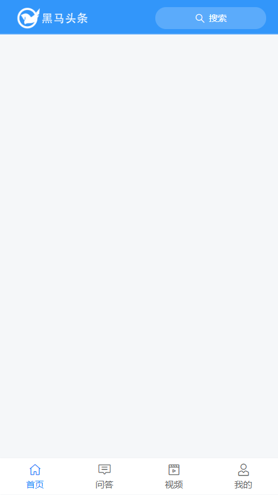
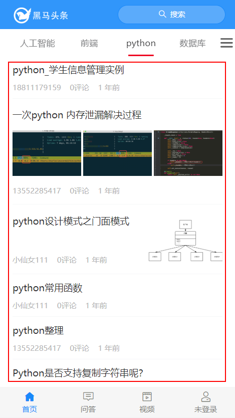
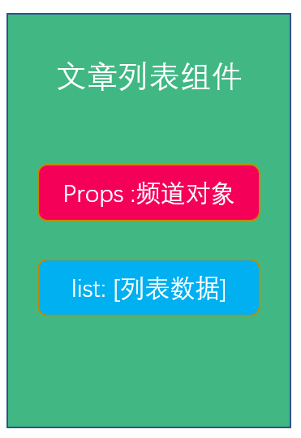
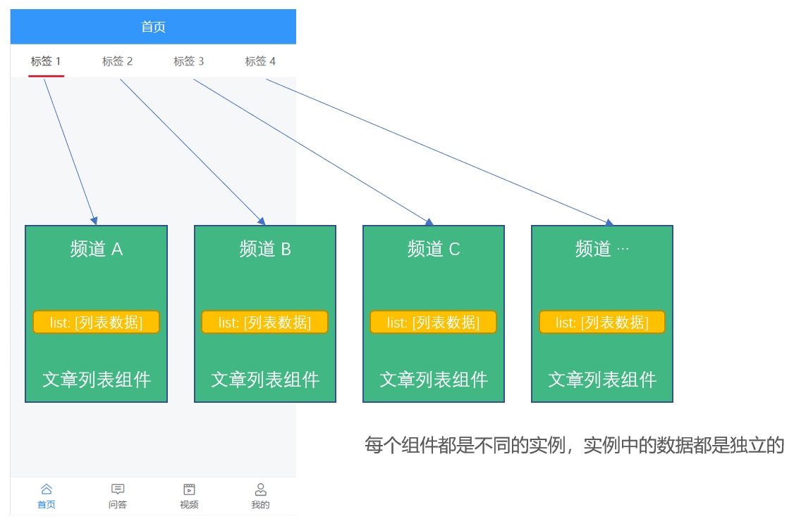
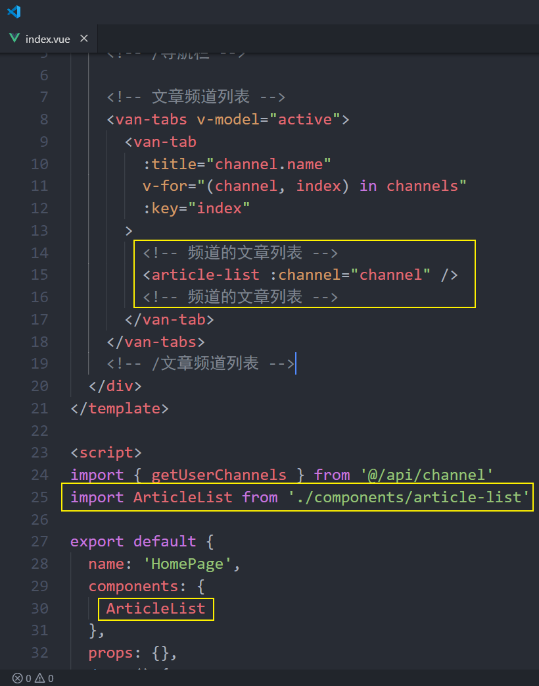

# 四、首页—文章列表


## 页面布局



```html
<template>
  <div class="home-container">
    <van-nav-bar class="page-nav-bar">
      <div slot="left" class="logo"></div>
      <van-button
        slot="right"
        class="search-btn"
        icon="search"
        type="default"
        size="small"
        round
      >搜索</van-button>
    </van-nav-bar>
  </div>
</template>

<script>
export default {
  name: 'HomePage',
  components: {},
  props: {},
  data () {
    return {}
  },
  computed: {},
  watch: {},
  created () {},
  mounted () {},
  methods: {}
}
</script>

<style scoped lang="less">
.page-nav-bar {
  .logo {
    background: url("./logo.png") no-repeat;
    width: 220px;
    height: 80px;
    background-size: contain;
  }
  .search-btn {
    background-color: #5babfb;
    border: none;
    width: 300px;
    color: #fff;
    .van-icon {
      color: #fff;
    }
  }
}
</style>

```


## 展示文章频道列表


处理流程：

- 使用 Tab 标签页组件布局
- 封装请求
- 请求获取数据
- 模板绑定
- 细节处理

1、封装请求接口

```js
/**
 * 频道请求模块
 */
import request from '@/utils/request'

/**
 * 获取频道列表
 */
export const getChannels = () => {
  return request({
    method: 'GET',
    url: '/app/v1_0/user/channels'
  })
}

```

2、在首页中请求加载，绑定模板

```html
<template>
  <div class="home-container">
    <!-- 导航栏 -->
    <van-nav-bar class="page-nav-bar">
      <div slot="left" class="logo"></div>
      <van-button
        slot="right"
        class="search-btn"
        icon="search"
        type="info"
        size="small"
        round
      >搜索</van-button>
    </van-nav-bar>
    <!-- /导航栏 -->

    <!-- 文章频道列表 -->
    <van-tabs v-model="active">
      <van-tab
        :title="channel.name"
        v-for="channel in channels"
        :key="channel.id"
				swipeable
				animated
      >{{ channel.name }} 的内容</van-tab>
    </van-tabs>
    <!-- /文章频道列表 -->
  </div>
</template>

<script>
import { getChannels } from '@/api/channel'

export default {
  name: 'HomePage',
  components: {},
  props: {},
  data () {
    return {
      active: 0, // 控制被激活的标签页
      channels: [] // 频道列表
    }
  },
  computed: {},
  watch: {},
  created () {
    this.loadChannels()
  },
  mounted () {},
  methods: {
    async loadChannels () {
      try {
        const { data } = await getChannels()
        this.channels = data.data.channels
      } catch (err) {
        console.log(err)
        this.$toast('数据获取失败')
      }
    }
  }
}
</script>

<style scoped lang="less">
.page-nav-bar {
  .logo {
    width: 220px;
    height: 80px;
    background: url("./logo.png") no-repeat;
    background-size: contain;
  }
  .search-btn {
    background-color: #5babfb;
    width: 300px;
    border: none;
    .van-icon {
      color: #fff;
    }
  }
}
</style>

```


## 展示文章列表



### 思路分析

根据不同的频道加载不同的文章列表，你的思路可能是这样的：

- 有一个 `list` 数组，用来存储文章列表
- 查看 `a` 频道：请求获取数据，让 `list = a` 频道文章
- 查看 `b` 频道：请求获取数据，让 `list = b` 频道文章
- 查看 `c` 频道：请求获取数据，让 `list = c` 频道文章
- ...


思路没有问题，但是并不是我们想要的效果。

我们想要的效果是：**加载过的数据列表不要重新加载**。


实现思路也非常简单，就是我们准备**多个 list 数组，每个频道对应一个，查看哪个频道就把数据往哪个频道的列表数组中存放，这样的话就不会导致覆盖问题**。


可是有多少频道就得有多少频道文章数组，我们都一个一个声明的话会非常麻烦，所以这里的建议是利用组件来处理。

具体做法就是：

- 封装一个文章列表组件
- 然后在频道列表中把文章列表遍历出来

**因为文章列表组件中请求获取文章列表数据需要频道 id，所以 频道 id 应该作为 props 参数传递给文章列表组件，为了方便，我们直接把频道对象传递给文章列表组件就可以了。**



在文章列表中请求获取对应的列表数据，展示到列表中。

最后把组件在频道列表中遍历出来，就像下面这样。




1、创建 `src/views/home/components/article-list.vue`

```html
<template>
  <div class="article-list">文章列表</div>
</template>

<script>
export default {
  name: 'ArticleList',
  components: {},
  props: {
    channel: {
      type: Object,
      required: true
    }
  },
  data () {
    return {}
  },
  computed: {},
  watch: {},
  created () {},
  mounted () {},
  methods: {}
}
</script>

<style scoped lang="less"></style>

```


2、在 `home/index.vue` 中注册使用




3、最后测试。


答疑：

- 为什么标签内容是懒渲染的？
  - 因为这是 Tab 标签页组件本身支持的默认功能，如果不需要可以通过配置 `:lazy-render="false"` 来关闭这个效果。

### 使用 List 列表组件

Vant 中提供的 [List 列表](https://youzan.github.io/vant/#/zh-CN/list) 组件支持上拉加载更多功能。

List 组件通过`loading`和`finished`两个变量控制加载状态，当组件滚动到底部时，会触发`load`事件并将`loading`设置成`true`。此时可以发起异步操作并更新数据，数据更新完毕后，将`loading`设置成`false`即可。若数据已全部加载完毕，则直接将`finished`设置成`true`即可。

- loading
- finished
- load 事件

List 初始化后会触发一次 load 事件，用于加载第一屏的数据，之后会监听浏览器的滚动事件并计算列表的位置，当列表快要触底时，List 会再次触发 load 事件。

如果一次请求加载的数据条数较少，导致列表内容无法铺满当前屏幕，List 会继续触发 load 事件，直到内容铺满屏幕或数据全部加载完成。


**List 的运行机制是什么？**

> List 会监听浏览器的滚动事件并计算列表的位置，当列表底部与可视区域的距离小于offset时，List 会触发一次 load 事件。


**为什么 List 初始化后会立即触发 load 事件？**

> List 初始化后会触发一次 load 事件，用于加载第一屏的数据，这个特性可以通过immediate-check属性关闭。


**为什么会连续触发 load 事件？**

> 如果一次请求加载的数据条数较少，导致列表内容无法铺满当前屏幕，List 会继续触发 load 事件，直到内容铺满屏幕或数据全部加载完成。因此你需要调整每次获取的数据条数，理想情况下每次请求获取的数据条数应能够填满一屏高度。


**loading 和 finished 分别是什么含义？**

> List有以下三种状态，理解这些状态有助于你正确地使用List组件：
>
> - 非加载中，loading为false，此时会根据列表滚动位置判断是否触发load事件（列表内容不足一屏幕时，会直接触发）
> - 加载中，loading为true，表示正在发送异步请求，此时不会触发load事件
> - 加载完成，finished为true，此时不会触发load事件
>
> 在每次请求完毕后，需要手动将loading设置为false，表示加载结束


**使用 float 布局后一直触发加载？**

> 若 List 的内容使用了 float 布局，可以在容器上添加van-clearfix类名来清除浮动，使得 List 能正确判断元素位置
>
> ```html
> <van-list>
>   <div class="van-clearfix">
>     <div class="float-item" />
>     <div class="float-item" />
>     <div class="float-item" />
>   </div>
> </van-list>
> ```


### 加载文章列表数据

实现思路：

- 找接口
- 封装请求方法
- 请求加载
- 模板绑定


1、创建 `src/api/article.js` 封装获取文章列表数据的接口

```js
/**
 * 文章接口模块
 */
import request from '@/utils/request'

/**
 * 获取频道的文章列表
 */
export const getArticles = params => {
  return request({
    method: 'GET',
    url: '/app/v1_1/articles',
    params
  })
}
```

> 注意：使用接口文档中最下面的 **频道新闻推荐\_V1.1**

2、然后在首页文章列表组件 `onload` 的时候请求加载文章列表

```html
<template>
  <div class="article-list">
      <!--
        loading 控制上拉加载更多的 loading 状态
        finished 控制数据是否加载结束
        load 事件：当触发上拉加载更多的时候会触发调用 load 事件

        List 初始化后会触发一次 load 事件，用于加载第一屏的数据
        如果一次请求加载的数据条数较少，导致列表内容无法铺满当前屏幕，List 会继续触发 load 事件，直到内容铺满屏幕或数据全部加载完成
      -->
      <van-list
        v-model="loading"
        :finished="finished"
        finished-text="没有更多了"
        :error.sync="error"
        error-text="请求失败，点击重新加载"
        @load="onLoad"
      >
        <van-cell
          v-for="(article, index) in list"
          :key="index"
          :title="article.title"
        />
      </van-list>
  </div>
</template>

<script>
import { getArticles } from '@/api/article'

export default {
  name: 'ArticleList',
  components: {},
  props: {
    channel: {
      type: Object,
      required: true
    }
  },
  data () {
    return {
      list: [], // 文章列表数据
      loading: false, // 上拉加载更多的 loading 状态
      finished: false, // 是否加载结束
      error: false, // 是否加载失败
      timestamp: null // 请求下一页数据的时间戳
    }
  },
  computed: {},
  watch: {},
  created () {},
  mounted () {},
  methods: {
    // 当触发上拉加载更多的时候调用该函数
    async onLoad () {
      try {
        // 1. 请求获取数据
        const { data } = await getArticles({
          channel_id: this.channel.id, // 频道 id
          timestamp: this.timestamp || Date.now(), // 时间戳，请求新的推荐数据传当前的时间戳，请求历史推荐传指定的时间戳
          with_top: 1 // 是否包含置顶，进入页面第一次请求时要包含置顶文章，1-包含置顶，0-不包含
        })

        // 2. 把数据添加到 list 数组中
        const { results } = data.data
        this.list.push(...results)

        // 3. 设置本次加载中 loading 状态结束
        this.loading = false

        // 4. 判断数据是否加载结束
        if (results.length) {
          // 更新获取下一页数据的时间戳
          this.timestamp = data.data.pre_timestamp
        } else {
          // 没有数据了，设置加载状态结束，不再触发上拉加载更多了
          this.finished = true
        }
      } catch (err) {
        console.log(err)
        this.loading = false // 关闭 loading 效果
        this.error = true // 开启错误提示
      }
    }
  }
}
</script>

<style scoped lang="less"></style>

```

最后测试。


### 下拉刷新


这里主要使用到 Vant 中的 [PullRefresh 下拉刷新](https://youzan.github.io/vant/#/zh-CN/pull-refresh) 组件。

思路：

- 注册下拉刷新事件（组件）的处理函数
- 发送请求获取文章列表数据
- 把获取到的数据添加到当前频道的文章列表的顶部
- 提示用户刷新成功！

下拉刷新时会触发组件的 `refresh` 事件，在事件的回调函数中可以进行同步或异步操作，操作完成后将 `v-model` 设置为 `false`，表示加载完成。

```js
// 当触发下拉刷新的时候调用该函数
async onRefresh () {
  try {
    // 1. 请求获取数据
    const { data } = await getArticles({
      channel_id: this.channel.id, // 频道 id
      timestamp: Date.now(), // 下拉刷新每次都应该获取最新数据
      with_top: 1 // 是否包含置顶，进入页面第一次请求时要包含置顶文章，1-包含置顶，0-不包含
    })

    // 2. 将数据追加到列表的顶部
    const { results } = data.data
    this.list.unshift(...results)

    // 3. 关闭下拉刷新的 loading 状态
    this.isRefreshLoading = false

    // 提示成功
    this.refreshSuccessText = `刷新成功，更新了${results.length}条数据`
  } catch (err) {
    console.log(err)
    this.isRefreshLoading = false // 关闭下拉刷新的 loading 状态
    this.$toast('刷新失败')
  }
}
```

## 优化文章列表

### 固定头部和频道列表

1、让头部固定定位

```html
<van-nav-bar fixed> ... </van-nav-bar>
```


2、让频道列表固定定位

```less
.home-container {
  /deep/ .van-tabs__wrap {
    position: fixed;
    top: 46px;
    left: 0;
    right: 0;
    z-index: 1;
  }
}
```

> [关于 .vue 文件中的作用域样式](https://vue-loader.vuejs.org/zh/guide/scoped-css.html)

3、给页面容器添加上下内边距

```less
.home-container {
  padding-top: 180px;
  padding-bottom: 100px;
}
```


如果想要在父组件中影响子组件样式：

- 要么不要有作用域，那就是全局，可以影响任何组件

- 如果有作用域
  - 默认只能影响到自子组件的根节点
    - 审查元素找到子组件根节点类名使用
    - 或者手动给子组件添加一个 class，它会自动添加到子组件根节点的 class 中
  - 如果需要影响的更深，则使用深度作用选择器：`>>>`、`/deep/`、`::v-deep`
    - `>>>` 在 less、sass、stylus 等 CSS 预处理器中会报错
    - 所以建议使用 `/deep/` 或者 `::v-deep`

### 记住列表的滚动位置

思路：

- 监听文章列表的滚动事件，将当前滚动的距离记录起来
- 当切换频道的时候将之前记录的滚动距离设置回去

一、设置滚动容器

1、给标签页组件外层包裹一个容器

```html
<div class="article-scroll-wrap" ref="article-scroll-wrap">
  <van-tabs>
    ...
  </van-tabs>
</div>
```

2、设置容器样式

```less
.article-list-wrap {
  height: 79vh;
  overflow-y: auto;
}
```

二、监听滚动事件

1、安装 lodash

```shell
npm i lodash
```

2、加载函数防抖处理函数

```js
import { debounce } from 'lodash'
```

3、在 mounted 中获取监听滚动容器的滚动事件

```js
mounted () {
  // debounce 函数防抖
  //    参数1：函数
  //    参数2：事件，单位是毫秒
  //    返回值：返回经过防抖处理的函数
  const articleScrollWrap = this.$refs['article-list-wrap']
  articleScrollWrap.onscroll = debounce(() => {
		console.log('onScroll')
  }, 50)
},
```


三、记录并设置滚动位置

1、在滚动事件处理函数中记录滚动的位置

```js
mounted () {
  // debounce 函数防抖
  //    参数1：函数
  //    参数2：事件，单位是毫秒
  //    返回值：返回经过防抖处理的函数
  const articleScrollWrap = this.articleScrollWrap
  articleScrollWrap.onscroll = debounce(() => {
    this.channels[this.active].scrollTop = articleScrollWrap.scrollTop
  }, 50)
},
```

2、当标签页切换的时候设置滚动容器的滚动位置

```html
<van-tabs change="onTabChange">
  ...
</van-tabs>
```

```js
onTabChange () {
  const scrollTop = this.channels[this.active].scrollTop
  if (scrollTop) {
    this.$nextTick(() => {
      this.articleScrollWrap.scrollTop = scrollTop
    })
    // this.articleScrollWrap.scrollTop = scrollTop
  }
}
```


四、关于 [$nextTick](https://cn.vuejs.org/v2/api/#vm-nextTick) 方法的作用

```html
<!DOCTYPE html>
<html lang="en">
<head>
  <meta charset="UTF-8">
  <meta name="viewport" content="width=device-width, initial-scale=1.0">
  <title>Document</title>
</head>
<body>
  <div id="app">
    <h1>关于 $nextTick() 的说明</h1>
    <p ref="p">{{ message }}</p>
    <button @click="changeMessage">改变 message</button>
  </div>
  <script src="./node_modules/vue/dist/vue.js"></script>
  <script>
    new Vue({
      el: '#app',
      data: {
        message: 'Hello World'
      },
      methods: {
        changeMessage () {
          // 数据驱动视图：当数据改变会影响视图更新
          // 但是这更新DOM这件事儿不是立即的
          this.message = '你好，世界'
          
          // console.log(this.$refs.p.innerHTML)

          // 如果你需要在数据改变之后立即操作受数据影响影响的视图 DOM
          // 最好放到 nextTick 函数中来执行，这样确保是没有问题的
          this.$nextTick(() => {
            console.log(this.$refs.p.innerHTML)
          })
        }
      }
    })
  </script>
</body>
</html>

```


## 文章列表项

### 组件封装

1、创建组件

2、加载注册

3、使用组件

### 布局处理

```html
<template>
  <van-cell class="article-item">
    <div slot="title" class="title">{{ article.title }}</div>
    <div slot="label">
      <!-- 如果有3个封面 -->
      <van-row
        v-if="article.cover.type === 3"
        gutter="5"
        class="article-cover-wrap"
      >
        <van-col
          span="8"
          v-for="(img, index) in article.cover.images"
          :key="index"
        >
          <van-image
            slot="default"
            class="article-cover"
            :src="img"
            fit="cover"
          />
        </van-col>
      </van-row>
      <div class="article-label">
        <span>{{ article.aut_name }}</span>
        <span>{{ article.comm_count }}评论</span>
        <span>{{ article.pubdate }}</span>
      </div>
    </div>
    <!-- 如果有1个封面 -->
    <van-image
      v-if="article.cover.type === 1"
      slot="default"
      class="article-cover"
      :src="article.cover.images[0]"
      fit="cover"
    />
  </van-cell>
</template>

<script>
export default {
  name: 'ArticleItem',
  components: {},
  props: {
    article: {
      type: Object,
      required: true
    }
  },
  data () {
    return {}
  },
  computed: {},
  watch: {},
  created () {},
  mounted () {},
  methods: {}
}
</script>

<style scoped lang="less">
.article-item {
  .title {
    font-size: 32px;
    color: #3a3a3a;
  }
  .article-label {
    span {
      margin-right: 20px;
    }
  }
  .article-cover-wrap {
    padding: 20px 0;
    .article-cover {
      width: 100%;
    }
  }
  .article-cover {
    width: 233px;
    height: 148px;
  }
}
</style>

```

### 解决第三方图片 403 问题

HTTP Referer是[header](https://baike.baidu.com/item/header/688992)的一部分，当浏览器向web[服务器](https://baike.baidu.com/item/服务器)发送请求的时候，一般会带上Referer，告诉服务器该网页是从哪个页面链接过来的，服务器因此可以获得一些信息用于处理。

这个图片是通过后台抓取的第三方平台的数据，第三方平台对这些资源进行了保护处理，它会判断如果你请求的地址不是来自于我接受的来源站点就返回403。

解决办法就是设置浏览器不要发送 referrer 就可以了。

接下面的声明放到项目中的 `index.html` 文件中。

```html
<meta name="referrer" content="no-referrer" />
```

### 图片懒加载

设置`lazy-load`属性来开启图片懒加载，需要搭配 [Lazyload](https://youzan.github.io/vant/#/zh-CN/lazyload) 组件使用。

`Lazyload` 是 `Vue` 指令，使用前需要对指令进行注册。

```js
import { Lazyload } from 'vant'

Vue.use(Lazyload)
```

然后给 Image 组件配置 `lazy-load` 指令属性开启懒加载

```html
<van-image
  width="100"
  height="100"
  lazy-load
  src="https://img.yzcdn.cn/vant/cat.jpeg"
/>
```

如果是普通的 img 则这样使用：

```html

```

如果是背景图，则这样使用：

> 和图片懒加载不同，背景图懒加载需要使用`v-lazy:background-image`，值设置为背景图片的地址，需要注意的是必须声明容器高度。

```html
<div  v-lazy:background-image="图片地址" />
```

更多内容请参照：[vue-lazyload 官方文档](https://github.com/hilongjw/vue-lazyload)

> 注意：如果浏览器控制台开启了 `Disable cache` 功能，则会看到每个图片出现两次请求，该问题并不影响最终结果。

### 处理相对时间

[Day.js](https://day.js.org/zh-CN/) 是一个轻量的处理时间和日期的 JavaScript 库，和 [Moment.js](https://momentjs.com/) 的 API 设计保持完全一样，如果您曾经用过 Moment.js, 那么您已经知道如何使用 Day.js 。

- Day.js 可以运行在浏览器和 Node.js 中。

- 🕒 和 Moment.js 相同的 API 和用法
- 💪 不可变数据 (Immutable)
- 🔥 支持链式操作 (Chainable)
- 🌐 国际化 I18n
- 📦 仅 2kb 大小的微型库
- 👫 全浏览器兼容


1、安装

```sh
npm i dayjs
```

2、创建 `utils/dayjs.js`

```js
import Vue from 'vue'
import dayjs from 'dayjs'

// 加载中文语言包
import 'dayjs/locale/zh-cn'

import relativeTime from 'dayjs/plugin/relativeTime'

// 配置使用处理相对时间的插件
dayjs.extend(relativeTime)

// 配置使用中文语言包
dayjs.locale('zh-cn')

// 全局过滤器：处理相对时间
Vue.filter('relativeTime', value => {
  return dayjs().to(dayjs(value))
})

```

3、在 `main.js` 中加载初始化

```js
import './utils/dayjs'
```

4、使用

使用过滤器：

```html
<p>{{ 日期数据 | relativeTime }}</p>
```

## 优化-组件缓存

先来看一个问题？

从首页切换到我的，再从我的回到首页，我们发现首页重新渲染原来的状态没有了，我想要某些页面保持状态，而不会随着路由切换导致重新渲染。


如何解决？

- [在动态组件上使用 `keep-alive`](https://cn.vuejs.org/v2/guide/components-dynamic-async.html#在动态组件上使用-keep-alive)


### 使用 keep-alive 缓存组件

`<keep-alive>` 主要用于保留组件状态或避免重新渲染，当它包裹动态组件时，会缓存不活动的组件实例，而不是销毁它们。

（1）`<keep-alive>` 是一个抽象组件：它自身不会渲染一个 DOM 元素，也不会出现在组件的父组件链中。

（2）`<keep-alive>` 要求被切换到的组件都有自己的名字，不论是通过组件的 `name` 选项还是局部/全局注册。

（3）当组件在 `<keep-alive>` 内被切换，它的 `activated` 和 `deactivated` 这两个生命周期钩子函数将会被对应执行。

```js
export default {
  created () {
    console.log('created 首次渲染时才执行')
  },
  mounted () {
    console.log('mounted 首次渲染时才执行')
  },
  
  // 渲染完成，组件会被缓存起来，之后不再触发 created 和 mounted
  
  activated () {
    console.log('当组件从缓存中被激活时触发调用')
  },
  deactivated () {
    console.log('当组件从缓存中失去活动时触发调用')
  }
}
```

（4）组件缓存只是在应用运行期间不会重新渲染，如果页面刷新还是会回到初始状态。

（5）`include` 和 `exclude` 属性允许组件有条件地缓存。二者都可以用逗号分隔字符串、正则表达式或一个数组来表示。

```html
<!-- 逗号分隔字符串 -->
<keep-alive include="a,b">
  <component :is="view"></component>
</keep-alive>

<!-- 正则表达式 (使用 `v-bind`) -->
<keep-alive :include="/a|b/">
  <component :is="view"></component>
</keep-alive>

<!-- 数组 (使用 `v-bind`) -->
<keep-alive :include="['a', 'b']">
  <component :is="view"></component>
</keep-alive>
```

匹配首先检查组件自身的 `name` 选项，如果 `name` 选项不可用，则匹配它的局部注册名称 (父组件 `components` 选项的键值)。匿名组件不能被匹配。

> 参考阅读
>
> - [在动态组件上使用 keep-alive](https://cn.vuejs.org/v2/guide/components-dynamic-async.html#在动态组件上使用-keep-alive)
> - [内置的组件 keep-alive](https://cn.vuejs.org/v2/api/#keep-alive)

### 项目中的缓存配置

1、在 `App.vue` 对根路由组件启用组件缓存

```html
<template>
  <div id="app">
    <!--
      一级路由出口
      缓存一级路由组件
    -->
    <keep-alive :include="cachePages">
      <router-view />
    </keep-alive>
  </div>
</template>

<script>
export default {
  name: 'App',
  data () {
    return {
      cachePages: ['TabBar']
    }
  }
}
</script>

<style lang="less"></style>

```

2、在 `views/tabbar/index.vue` 对子路由也启用组件缓存

```html
<keep-alive>
  <router-view />
</keep-alive>
```


### 解决项目中组件缓存带来的问题

一、首页文章列表滚动位置

```js
activated () {
  this.onTabChange()
},
methods: {
  onTabChange () {
    const activeChannel = this.channels[this.active]
    if (!activeChannel) {
      return
    }
    const scrollTop = activeChannel.scrollTop
    if (scrollTop) {
      this.$nextTick(() => {
        this.articleScrollWrap.scrollTop = scrollTop
      })
      // this.articleScrollWrap.scrollTop = scrollTop
    }
  }
}
```


二、登录成功，我的页面数据不更新问题

```js
created () {
  // if (this.$store.state.user) {
  //   this.loadUser()
  // }
},
mounted () {},
activated () {
  if (this.$store.state.user) {
    this.loadUser()
  }
},
```


## 总结

