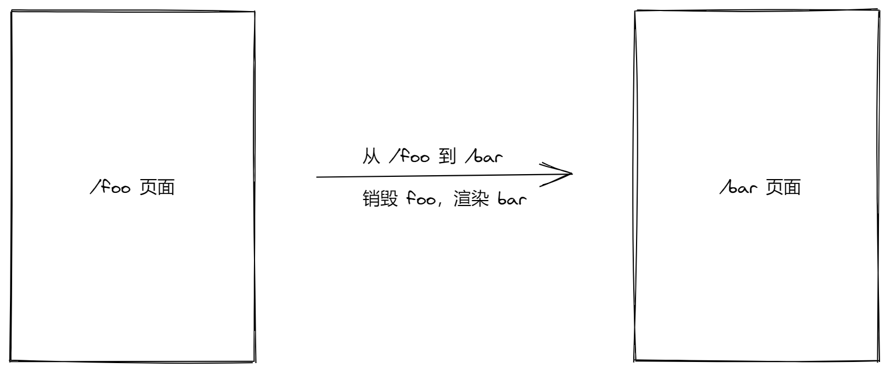

# 十五、功能优化

## 组件缓存

### 介绍

先来看一个问题？

从首页切换到我的，再从我的回到首页，我们发现首页重新渲染原来的状态没有了。

首先，这是正常的状态，并非问题，路由在切换的时候会销毁切出去的页面组件，然后渲染匹配到的页面组件。



但是我想要某些页面保持状态，而不会随着路由切换导致重新渲染。


### 使用 keep-alive 缓存组件

> 官方文档：[在动态组件上使用 `keep-alive`](https://cn.vuejs.org/v2/guide/components-dynamic-async.html#在动态组件上使用-keep-alive)

`<keep-alive>` 主要用于保留组件状态或避免重新渲染，当它包裹动态组件时，会缓存不活动的组件实例，而不是销毁它们。

（1）组件缓存不是持久化，它只是在应用运行期间不会重新渲染，如果页面刷新还是会回到初始状态。

（2）`<keep-alive>` 是一个抽象组件：它自身不会渲染一个 DOM 元素，也不会出现在组件的父组件链中。

（3）`<keep-alive>` 要求被切换到的组件都有自己的名字，不论是通过组件的 `name` 选项还是局部/全局注册。

（4）组件生命周期钩子和缓存

| 钩子函数      | 执行时机                                                     |
| ------------- | ------------------------------------------------------------ |
| beforeCreate  | 初始渲染执行，缓存后不再执行，除非重新渲染                   |
| created       | 初始渲染执行，缓存后不再执行，除非重新渲染                   |
| beforeMount   | 初始渲染执行，缓存后不再执行，除非重新渲染                   |
| mounted       | 初始渲染执行，缓存后不再执行，除非重新渲染                   |
| beforeUpdate  | 更新前执行，不受缓存影响                                     |
| updated       | 更新后执行，不受缓存影响                                     |
| activated     | 被 keep-alive 缓存的组件激活时调用（包括首次渲染激活），没有缓存不会调用 |
| deactivated   | 被 keep-alive 缓存的组件停用时调用，没有缓存不会调用         |
| beforeDestroy | 组件销毁前执行，缓存后不再执行，除非清除缓存（相当于销毁组件） |
| destroyed     | 组件销毁后执行，缓存后不再执行，除非清除缓存（相当于销毁组件） |

具体使用要根据实际情况来处理，在我们项目后续的业务功能中慢慢体会。

（5）`include` 和 `exclude` 属性允许组件有条件地缓存。二者都可以用逗号分隔字符串、正则表达式或一个数组来表示。

```html
<!-- 逗号分隔字符串 -->
<keep-alive include="a,b">
  <component :is="view"></component>
</keep-alive>

<!-- 正则表达式 (使用 `v-bind`) -->
<keep-alive :include="/a|b/">
  <component :is="view"></component>
</keep-alive>

<!-- 数组 (使用 `v-bind`) -->
<keep-alive :include="['a', 'b']">
  <component :is="view"></component>
</keep-alive>
```

匹配首先检查组件自身的 `name` 选项，如果 `name` 选项不可用，则匹配它的局部注册名称 (父组件 `components` 选项的键值)。匿名组件不能被匹配。

> 参考阅读
>
> - [在动态组件上使用 keep-alive](https://cn.vuejs.org/v2/guide/components-dynamic-async.html#在动态组件上使用-keep-alive)
> - [内置的组件 keep-alive](https://cn.vuejs.org/v2/api/#keep-alive)

### 项目中的缓存配置

> 参考链接：
>
> - https://juejin.im/post/5d22f0f3f265da1b94216d0b

1、在 `App.vue` 对根路由组件启用组件缓存

```html
<template>
  <div id="app">
    <!--
      一级路由出口
      缓存一级路由组件
    -->
    <keep-alive :include="cachePages">
      <router-view />
    </keep-alive>
  </div>
</template>

<script>
export default {
  name: 'App',
  data () {
    return {
      cachePages: ['TabBar']
    }
  }
}
</script>

<style lang="less"></style>

```

2、在 `views/tabbar/index.vue` 对子路由也启用组件缓存

```html
<keep-alive>
  <router-view />
</keep-alive>
```

### 解决缓存之后我的页面用户数据不更新问题

将原来 created 中的逻辑代码写到 activated 中：

```js
activated () {
  if (this.user) {
    this.loadUserInfo()
  }
},
```


### 解决缓存之后首页文章列表滚动位置问题

1、在 data 中定义数据用来存储距离顶部的位置

```js
scrollTop: 0 // 距离顶部的距离
```

2、在 mounted 中使用函数防抖监听列表容器的滚动事件，将距离顶部的位置记录起来

```js
mounted () {
  const articleList = this.$refs['article-list']

  // debounce 方法：函数防抖
  // 参数1：一个函数
  // 参数2：延迟时间，单位是毫秒
  // 返回值：返回一个防抖处理的函数，功能和参数1的功能是一样的
  articleList.onscroll = debounce(() => {
    this.scrollTop = articleList.scrollTop
  }, 100)
},
```

3、在组件缓存激活的钩子函数中将原来记录的位置设置回去

```js
activated () {
  const articleList = this.$refs['article-list']
  articleList.scrollTop = this.scrollTop
},
```

## 处理 token 过期

> 参考链接：
>
> - https://juejin.im/post/5b55c118f265da0f6f1aa354

```js
// 响应拦截器
// Add a response interceptor
request.interceptors.response.use(
  // 在2xx范围内的任何状态代码都会触发此函数，这里主要用于处理响应数据
  response => {
    return response
  },
  // 任何超出2xx范围的状态码都会触发此函数，这里主要用于处理响应错误
  error => {
    const { status } = error.response
    if (status === 401) { // 未授权
    } else if (status === 403) { // 没有权限
    } else if (status === 404) { // 资源不存在
      Toast.fail({
        message: '请求资源不存在',
        forbidClick: true
      })
    } else if (status >= 500) { // 服务端异常
      Toast.fail({
        message: '服务端异常，请稍后重试',
        forbidClick: true
      })
    }

    // 将未处理的异常往外抛
    return Promise.reject(error)
  })
```


## 登录成功跳转回原来页面

首先在响应拦截器中：

```js
// 响应拦截器
request.interceptors.response.use(
  // 响应成功进入第1个函数
  // 该函数的参数是响应对象
  function (response) {
    // Any status code that lie within the range of 2xx cause this function to trigger
    // Do something with response data
    return response
  },
  // 响应失败进入第2个函数，该函数的参数是错误对象
  async function (error) {
    // Any status codes that falls outside the range of 2xx cause this function to trigger
    // Do something with response error
    // 如果响应码是 401 ，则请求获取新的 token

    // 响应拦截器中的 error 就是那个响应的错误对象
    console.dir(error)
    if (error.response && error.response.status === 401) {
      // 校验是否有 refresh_token
      const user = store.state.user

      if (!user || !user.refresh_token) {
        // router.push('/login')
+        redirectLogin()

        // 代码不要往后执行了
        return
      }

      // 如果有refresh_token，则请求获取新的 token
      try {
        const res = await axios({
          method: 'PUT',
          url: 'http://ttapi.research.itcast.cn/app/v1_0/authorizations',
          headers: {
            Authorization: `Bearer ${user.refresh_token}`
          }
        })

        // 如果获取成功，则把新的 token 更新到容器中
        console.log('刷新 token  成功', res)
        store.commit('setUser', {
          token: res.data.data.token, // 最新获取的可用 token
          refresh_token: user.refresh_token // 还是原来的 refresh_token
        })

        // 把之前失败的用户请求继续发出去
        // config 是一个对象，其中包含本次失败请求相关的那些配置信息，例如 url、method 都有
        // return 把 request 的请求结果继续返回给发请求的具体位置
        return request(error.config)
      } catch (err) {
        // 如果获取失败，直接跳转 登录页
        console.log('请求刷线 token 失败', err)
        // router.push('/login')
+        redirectLogin()
      }
    }

    return Promise.reject(error)
  }
)

+ function redirectLogin () {
+   // router.currentRoute 当前路由对象，和你在组件中访问的 this.$route 是同一个东西
    // query 参数的数据格式就是：?key=value&key=value
+   router.push('/login?redirect=' + router.currentRoute.fullPath)
+ }

```

然后在登录成功以后：

```js
const redirect = this.$route.query.redirect || "/";
this.$router.push(redirect);
```


## 组件缓存

> 参考文档：
>
> - [在动态组件上使用 `keep-alive`](https://cn.vuejs.org/v2/guide/components-dynamic-async.html#在动态组件上使用-keep-alive)

```html
<!-- 失活的组件将会被缓存！-->
<keep-alive>
  动态组件
</keep-alive>
```

> 注意：`<keep-alive>` 要求被切换到的组件都有自己的名字，不论是通过组件的 `name` 选项还是局部/全局注册。

1、在 App.vue 对根路由组件启用组件缓存

```html
<keep-alive>
  <router-view />
</keep-alive>
```

2、在 `views/tabbar/index.vue` 对子路由也启用组件缓存

```html
<keep-alive>
  <router-view />
</keep-alive>
```

### 禁用组件缓存

> 参考文档：
>
> - https://cn.vuejs.org/v2/api/#keep-alive

手动销毁的方式需要修改组件内部的代码，这里介绍一种更灵活的方式来配置哪些组件缓存，哪些组件不缓存。

`include` 和 `exclude` 属性允许组件有条件地缓存。二者都可以用逗号分隔字符串、正则表达式或一个数组来表示：

```html
<!-- 逗号分隔字符串 -->
<keep-alive include="a,b">
  <component :is="view"></component>
</keep-alive>

<!-- 正则表达式 (使用 `v-bind`) -->
<keep-alive :include="/a|b/">
  <component :is="view"></component>
</keep-alive>

<!-- 数组 (使用 `v-bind`) -->
<keep-alive :include="['a', 'b']">
  <component :is="view"></component>
</keep-alive>
```

匹配首先检查组件自身的 `name` 选项，如果 `name` 选项不可用，则匹配它的局部注册名称 (父组件 `components` 选项的键值)。匿名组件不能被匹配。


总结：

- 根据需要设置需要缓存的组件
- 缓存需要占用更大的内容，当缓存组件过多的时候容易造成页面卡顿
- 把不需要缓存的组件排除缓存

## 处理页面的访问权限

1、给需要登录状态才能访问的页面路由对象的 meta 中添加配置属性

```js
{ // 小智同学
  name: 'user-chat',
  path: '/user/chat',
  component: () => import('@/views/user-chat'),
  meta: { requiresAuth: true }
},
```

2、通过路由拦截器统一校验

```js
router.beforeEach((to, from, next) => {
  if (to.name === 'login' || !to.meta.requiresAuth) {
    return next()
  }

  if (store.state.user) {
    return next()
  }

  Dialog.confirm({
    title: '该功能需要登录，确认登录吗？'
  }).then(() => {
    next({
      name: 'login',
      query: {
        redirect: from.fullPath
      }
    })
  }).catch(() => {
    // on cancel
  })
})
```

