# 黑马头条移动端项目介绍

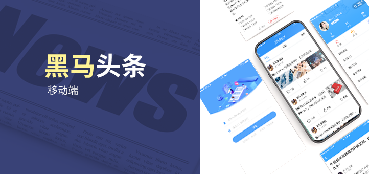

内容概要：

- 项目概述
- 技术栈
- 业务功能
- 课程大纲

## 项目概述

做什么？

```
开发一个类似于手机今日头条、网易新闻的移动端新闻资讯类移动应用。
```


有哪些业务？

```
本项目涵盖了新闻资讯类 App 的重点核心功能，其中包括：用户登录 / 注册、文章列表、文章详情、文章评论、个人资料、用户中心、频道管理、文章搜索、用户收藏 / 历史 / 作品，以及机器人聊天等功能。
```


用的什么技术栈？

```
本项目采用完全前后端分离的开发模式，使用 Vue.js 技术栈（全家桶）构建的移动端 SPA 单页面应用程序。
```


本项目是 Vue.js 框架课程的进阶项目，项目选用目前国内最流行的前端框架：Vue.js，课程总天数：10 天，业务模块：11 个，后台接口：50+，本项目是我们就业支撑的重要课程之一，适合有 Vue 或 MVVM 框架使用经验的同学学习。

- 演示地址：[http://m-toutiao-web.itheima.net/](http://m-toutiao-web.itheima.net/)
- 测试账号：
  - 用户名：13911111111
  - 密码：246810


### 就业方向建议

- 从事基于 Vue.js 技术栈的移动 Web 开发
- 从事基于 Vue.js 技术栈的移动 App 开发


## 业务功能

本项目的目标是完成一个新闻资讯类 App 的核心功能，但项目中所覆盖的核心业务却非常具有普适性，在众多 App 中都有体现，诸如：

- 基于 Token 的验证方案处理用户登录
- 移动端表单验证方案及交互提示
- 短信验证码的发送与验证
- 用户中心、个人资料展示
- 对文章内容的收藏、点赞和分享
- 编辑用户资料，其中包括基本信息修改及头像裁切上传等功能
- 列表类页面的加载、缓存及优化
- 列表类页面的下拉刷新和上拉加载更多
- 资讯类文章详情展示和文章评论
- 完整的搜索业务：输入联想建议、搜索关键词高亮、搜索历史记录、搜索结果列表等
- 即时通信核心业务及基于 WebSocket 的数据通信

经过实战级项目的学习与训练之后，相信无论是在面试还是实际工作，当你遇到以上业务的开发需求时，都能信心满满从容应对。


### 功能框架图

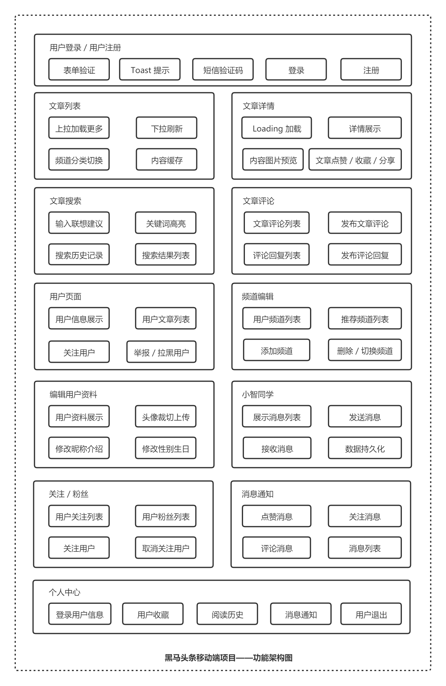

### 部分项目截图

| 首页                                                  | 登录                                                    |
| ----------------------------------------------------- | ------------------------------------------------------- |
| 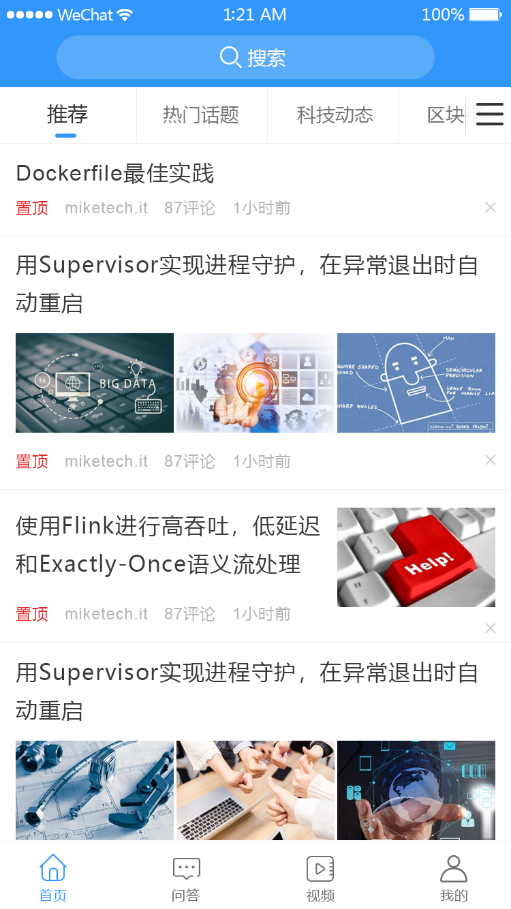    | 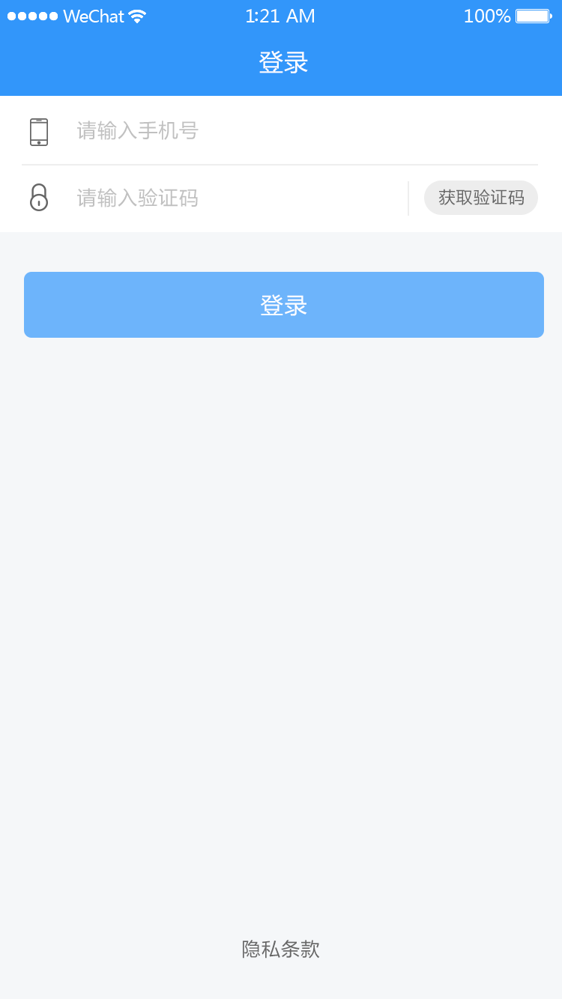       |
| 频道编辑                                              | 个人信息页                                              |
| 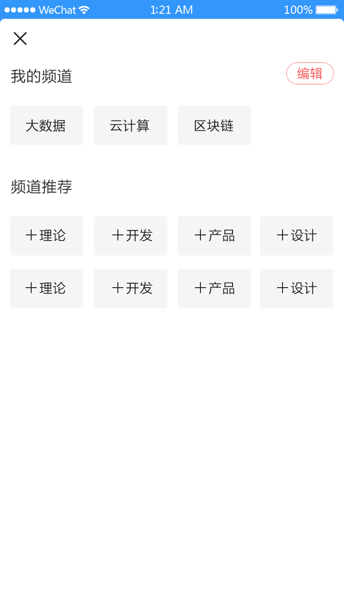 | 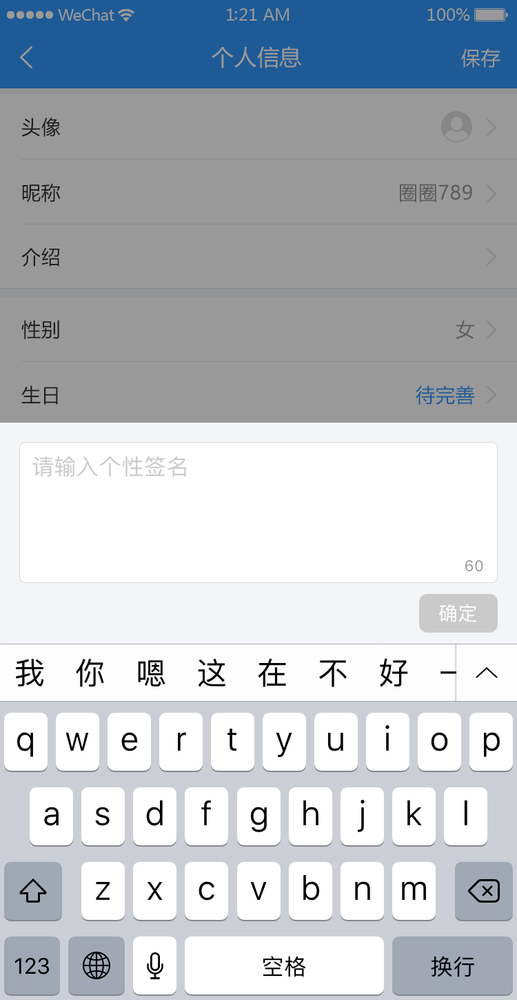 |
| 个人页面                                              | 关注/粉丝                                               |
| 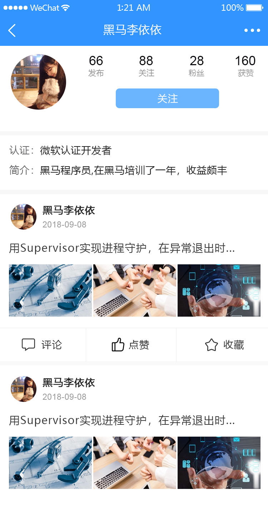 | 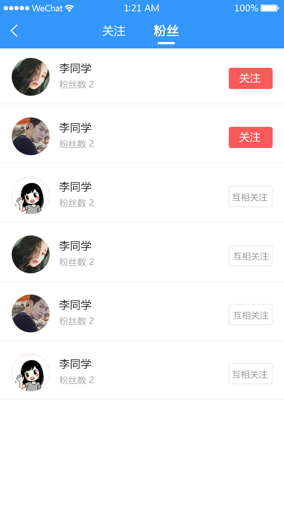   |
| 文章搜索                                              | 文章详情                                                |
| 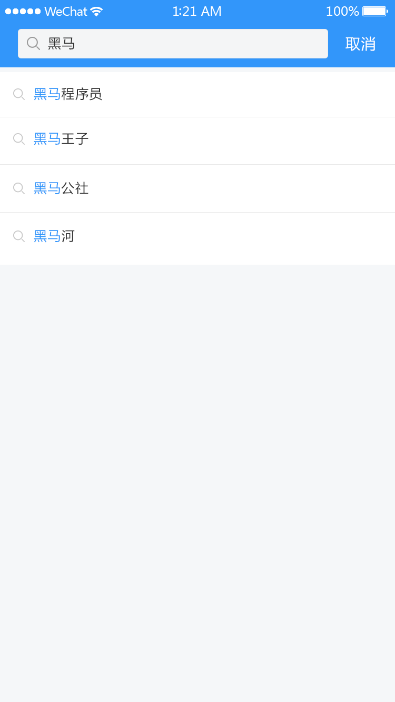     | 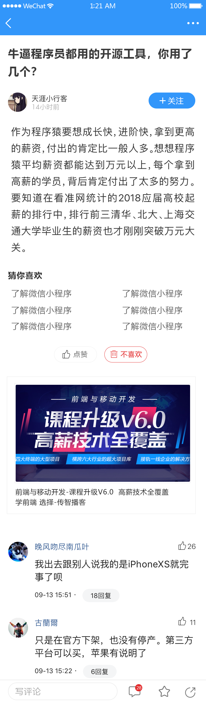       |
| 小智同学                                              | 个人中心                                                |
| 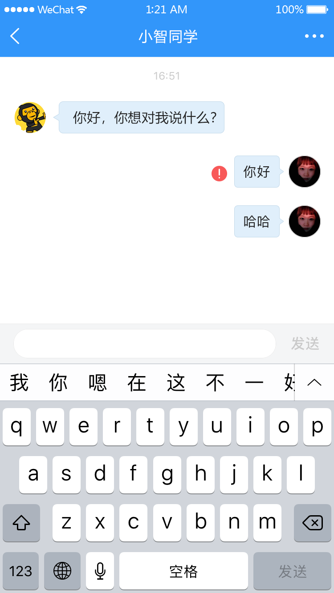 | 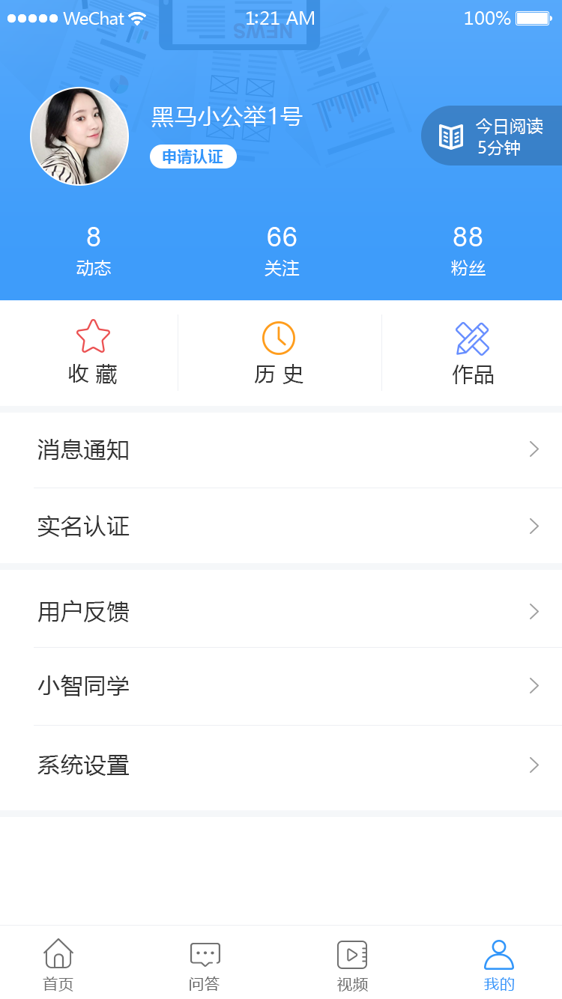       |


## 技术解决方案

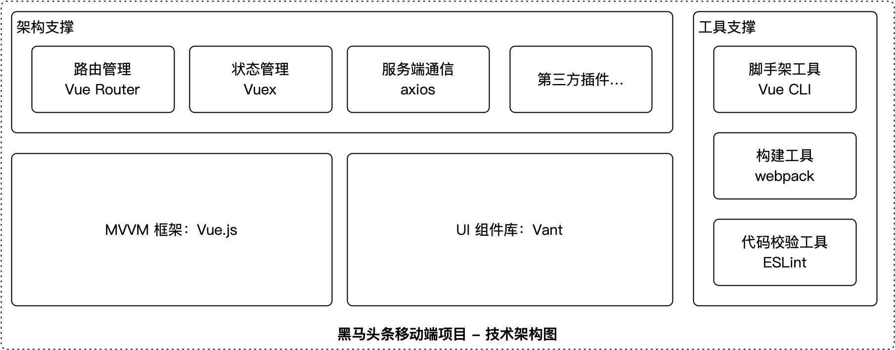

本项目采用了以下项技术解决方案：

1. 基于 Vue.js 的前端框架
2. 基于 webpack 工程化开发解决方案
3. 基于 Vant 的前端 UI 组件库，开发效率更高
4. 基于 axios 的请求库，功能强大性能高效
5. 基于 RESTful 风格的数据 API 解决方案（90% 的后端均采用这种风格提供数据 API，全栈级能力，升职加薪不在话下）
6. 基于 JWT 的 Token 状态维持解决方案（能够让你强化更多服务器知识）
7. 基于 Vue Router 的路由管理方案
8. 基于 Vuex 的状态共享方案
9. 基于 Vue CLI 的脚手架工具，快速创建项目快速开发
10. 基于 Socket.IO 的实时通信解决方案
11. 基于 PostCSS 的移动端 REM 适配解决方案
12. 基于 DCloud 平台的移动 App 开发解决方案

以上技术能力是时下一线企业对每一位前端工程师的基准要求。不过由于前端技术的演化速度太快，现在仍有一些一线的前端工程师处在自学和探索阶段，自己找寻着这些技术的使用场景及最佳实践。

而我们的课程则是以项目的核心业务需求为驱动，以技术解决方案为支撑，不仅能让你在短时间内学会这些技术的使用，还能够应用这些技术解决一个有一个真实的企业级业务需求，为你的技能成长做好铺垫，也为你的求职就业助力。

## 课程大纲

在选择机构学习之前，相信大家最关心的就是学科的项目课程靠不靠谱，项目课程的技术方案有没有技术领先性和市场竞争力。

因为大家都知道，对于编程学科而言，只有通过实打实的项目课程的学习，才能有效地习得并训练自己的业务分析能力，了解各个技术解决方案的对比和优劣，并最终通过编码实现项目的业务需求。而这些能力是我们成长为一名合格的前端工程师步入职场必备的技能。同时，这些能力掌握的程度也会影响到我们未来就业的薪资水平。

以下是黑马头条移动端项目课程的大纲。该大纲以课程模块为主线，并列举每个模块能够学习到的核心技术，以及完成每个模块的学习之后你能获得的能力。

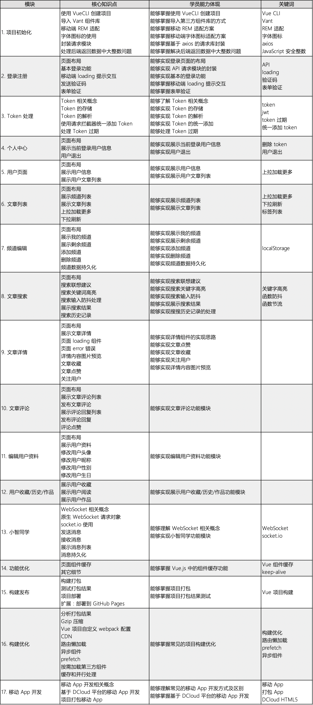

