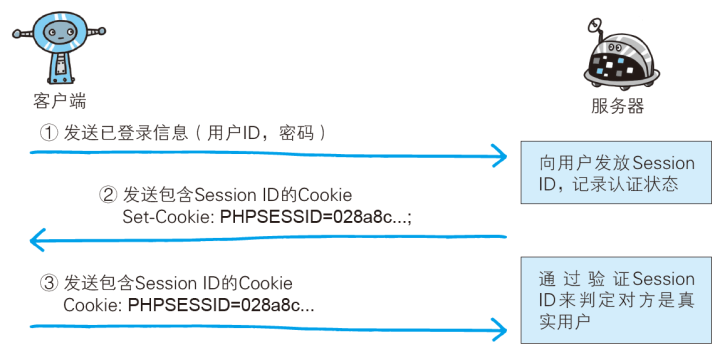

# 三、Token 处理

Token 是用户登录成功之后服务端返回的一个身份令牌，在项目中的多个业务中需要使用到：

- 访问需要授权的 API 接口
- 校验页面的访问权限
- ...


## Token 介绍

### Token 是什么


### HTTP 是无状态的


### 基于 Session 的用户认证

Session 其实就是把对安全性要求比较高的状态数据放到了服务端，把访问数据的钥匙放到了用户的本地（Cookie）。

用户的登录状态肯定是安全性要求比较高的，所以通常会使用 Session 来存储用户的登录状态。



1、用户向服务器发送用户名和密码。

2、服务器验证通过后，在当前对话（session）里面保存相关数据，比如用户角色、登录时间等等。

3、服务器向用户返回一个 session_id，写入用户的 Cookie。

4、用户随后的每一次请求，都会通过 Cookie，将 session_id 传回服务器。

5、服务器收到 session_id，找到前期保存的数据，由此得知用户的身份。


这种模式的问题在于，扩展性（scaling）不好。单机当然没有问题，如果是服务器集群，或者是跨域的服务导向架构，就要求 session 数据共享，每台服务器都能够读取 session。

举例来说，A 网站和 B 网站是同一家公司的关联服务。现在要求，用户只要在其中一个网站登录，再访问另一个网站就会自动登录，请问怎么实现？

一种解决方案是 session 数据持久化，写入数据库或别的持久层。各种服务收到请求后，都向持久层请求数据。这种方案的优点是架构清晰，缺点是工程量比较大。另外，持久层万一挂了，就会单点失败。

另一种方案是服务器索性不保存 session 数据了，所有数据都保存在客户端，每次请求都发回服务器。

### 基于 Token（令牌、凭据、凭证） 的状态保持

基于 Token 的的思路是，服务器认证以后，生成一个加密数据（令牌），发回给用户，数据内容就像下面这样。

```json
{
  "姓名": "张三",
  "角色": "管理员",
  "到期时间": "2018年7月1日0点0分"
}
```

以后，用户与服务端通信的时候，都要发回这个加密数据（令牌）。服务器通过解密获取明文数据就知道了用户身份。

服务器就不保存任何 session 数据了，也就是说，服务器变成无状态了，从而比较容易实现扩展。

基于 `token` 的鉴权机制类似于 HTTP 协议也是无状态的，它不需要在服务端去保留用户的认证信息或者会话信息。这就意味着基于 `token` 认证机制的应用不需要去考虑用户在哪一台服务器登录了，这就为应用的扩展提供了便利。


1、用户使用用户名密码来请求服务器

2、服务器进行验证用户的信息

3、服务器通过验证发送给用户一个 token

4、客户端存储 token，并在每次请求时附送上这个 token 值

5、服务端验证 token 值，并返回数据


以上就是基于 Token 认证的思路。

### JWT（JSON Web Token）

有了基于 Token 认证的思路了，该如何实现呢？例如

- 如何生成 Token？
- 如何加密？
- 如何解密？
- 如何规定数据格式？

如果大家都各自搞一套，太麻烦。所以社区中制定了一个具体实现：[JSON Web Token](https://jwt.io/)。

- Java
- PHP
- Ruby
- Python
- Node.js
- 。。。。

该方案主要是对 JSON 格式数据进行加解密以及数据格式的规范，方便前后端交互。


Json web token (JWT), 是为了在网络应用环境间传递声明而执行的一种基于JSON的开放标准（[(RFC 7519](https://link.jianshu.com?t=https://tools.ietf.org/html/rfc7519)).该token被设计为紧凑且安全的，特别适用于分布式站点的单点登录（SSO）场景。JWT的声明一般被用来在身份提供者和服务提供者间传递被认证的用户身份信息，以便于从资源服务器获取资源，也可以增加一些额外的其它业务逻辑所必须的声明信息，该token也可直接被用于认证，也可被加密。

JWT 的一些特点如下：

（1）JWT 默认是不加密，但也是可以加密的。生成原始 Token 以后，可以用密钥再加密一次。

（2）JWT 不加密的情况下，不能将秘密数据写入 JWT。

（3）JWT 不仅可以用于认证，也可以用于交换信息。有效使用 JWT，可以降低服务器查询数据库的次数。

（4）JWT 的最大缺点是，由于服务器不保存 session 状态，因此无法在使用过程中废止某个 token，或者更改 token 的权限。也就是说，一旦 JWT 签发了，在到期之前就会始终有效，除非服务器部署额外的逻辑。

（5）JWT 本身包含了认证信息，一旦泄露，任何人都可以获得该令牌的所有权限。为了减少盗用，JWT 的有效期应该设置得比较短。对于一些比较重要的权限，使用时应该再次对用户进行认证。

（6）为了减少盗用，JWT 不应该使用 HTTP 协议明码传输，要使用 HTTPS 协议传输。

> 扩展阅读
>
> - http://www.ruanyifeng.com/blog/2018/07/json_web_token-tutorial.html

## 存储 Token


> 我们只有在第一次用户登录成功之后才能拿到 Token。


> 但是我们需要在项目中的多个业务中使用 Token 数据。

所以为了能在其它模块中获取到 Token 数据，我们需要把它存储到一个公共的位置，方便随时取用。

往哪儿存？

- 本地存储
  - 获取麻烦
  - 数据不是响应式
- Vuex 容器（推荐）
  - 获取方便
  - 响应式的


使用容器存储 Token 的思路：


- 登录成功，将 Token 存储到 Vuex 容器中
  - 获取方便
  - 响应式
- 为了持久化，还需要把 Token 放到本地存储
  - 持久化

下面是具体实现。

一、使用 Vuex 容器存储 token

1、在 `src/store/index.js` 中

```js
import Vue from 'vue'
import Vuex from 'vuex'

Vue.use(Vuex)

export default new Vuex.Store({
  state: {
    // 用户的登录状态信息
    user: JSON.parse(window.localStorage.getItem('TOUTIAO_USER'))
    // user: null
  },
  mutations: {
    setUser (state, user) {
      state.user = user
      window.localStorage.setItem('TOUTIAO_USER', JSON.stringify(user))
    }
  },
  actions: {
  },
  modules: {
  }
})

```

2、登录成功以后将后端返回的 token 相关数据存储到容器中

```js
async onLogin () {
  // const loginToast = this.$toast.loading({
  this.$toast.loading({
    duration: 0, // 持续时间，0表示持续展示不停止
    forbidClick: true, // 是否禁止背景点击
    message: '登录中...' // 提示消息
  })

  try {
    const res = await login(this.user)

    // res.data.data => { token: 'xxx', refresh_token: 'xxx' }
+    this.$store.commit('setUser', res.data.data)

    // 提示 success 或者 fail 的时候，会先把其它的 toast 先清除
    this.$toast.success('登录成功')
  } catch (err) {
    console.log('登录失败', err)
    this.$toast.fail('登录失败，手机号或验证码错误')
  }

  // 停止 loading，它会把当前页面中所有的 toast 都给清除
  // loginToast.clear()
}
```

## 优化封装本地存储操作模块

创建 `src/utils/storage.js` 模块。

```js
export const getItem = name => {
  const data = window.localStorage.getItem(name)
  try {
    return JSON.parse(data)
  } catch (err) {
    return data
  }
}

export const setItem = (name, value) => {
  if (typeof value === 'object') {
    value = JSON.stringify(value)
  }
  window.localStorage.setItem(name, value)
}

export const removeItem = name => {
  window.localStorage.removeItem(name)
}

```

## 发送 Token

项目中的接口除了登录之外大多数都需要提供 token 才有访问权限。

通过接口文档可以看到，后端接口要求我们将 token 放到请求头 `Header` 中并以下面的格式发送。


> 字段名称：`Authorization`
>
> 字段值：`Bearer token`，注意 `Bearer` 和 `token` 之间有一个空格

方式一：在每次请求的时候手动添加（麻烦）。

```js
axios({
  method: "",
  url: "",
  headers: {
    Authorization: "Bearer token"
  }
})
```

方式二：使用请求拦截器统一添加（推荐，更方便）。


在 `src/utils/request.js` 中添加拦截器统一设置 token：

```js
/**
 * 请求模块
 */
import axios from 'axios'
import store from '@/store'

const request = axios.create({
  baseURL: 'http://ttapi.research.itcast.cn/' // 接口的基准路径
})

// 请求拦截器
// Add a request interceptor
request.interceptors.request.use(function (config) {
  // Do something before request is sent
  // config ：本次请求的配置对象
  // config 里面有一个属性：headers
  const { user } = store.state
  if (user && user.token) {
    config.headers.Authorization = `Bearer ${user.token}`
  }
  return config
}, function (error) {
  // Do something with request error
  return Promise.reject(error)
})

// 响应拦截器

export default request

```


## 解析 Token

项目中的某些业务功能需要使用到**登录用户的 ID**，正常的话建议在登录成功之后由后端返回，但是如果后端没有提供的话，我们也可以通过解析 JWT 来获取。

> 提示：Token 中一定有表示用户身份的数据 ID。

这里主要使用到一个第三方工具包：[jwt-decode](https://github.com/auth0/jwt-decode)。

1、安装

```bash
npm i jwt-decode
```

2、然后在容器中

```js
import decodeJwt from 'jwt-decode'
```

```js
setUser (state, data) {
  // 解析 JWT 中的数据（需要使用用户ID）
  if (data && data.token) {
    data.id = decodeJwt(data.token).user_id
  }

  state.user = data

  // 为了防止刷新丢失 state 中的 user 状态，我们把它放到本地存储
  setItem('user', state.user)
},
```

之后就可以直接通过 `store.state.user.id` 来访问使用了。

## 处理 Token 过期

> 提示
>
> 我们的项目接口中设定的 `Token` 有效期是 `2 小时`，超过有效期会返回 `401`，所以大家**在学习测试的时候如果收到 401 响应码，请重新登录再测试**。
>
> 到课程的后面我们开发的业务功能丰富起来之后，再给大家讲解 Token 过期处理。


概述：服务器生成token的过程中，会有两个时间，一个是token失效时间，一个是token刷新时间，刷新时间肯定比失效时间长，当用户的 `token` 过期时，你可以拿着过期的token去换取新的token，来保持用户的登陆状态，当然你这个过期token的过期时间必须在刷新时间之内，如果超出了刷新时间，那么返回的依旧是 401。

处理流程：

1. 在axios的拦截器中加入token刷新逻辑
2. 当用户token过期时，去向服务器请求新的 token
3. 把旧的token替换为新的token
4. 然后继续用户当前的请求

在请求的响应拦截器中统一处理 token 过期：

```js
/**
 * 封装 axios 请求模块
 */
import axios from "axios";
import jsonBig from "json-bigint";
import store from "@/store";
import router from "@/router";

// axios.create 方法：复制一个 axios
const request = axios.create({
  baseURL: "http://ttapi.research.itcast.cn/" // 基础路径
});

/**
 * 配置处理后端返回数据中超出 js 安全整数范围问题
 */
request.defaults.transformResponse = [
  function(data) {
    try {
      return jsonBig.parse(data);
    } catch (err) {
      return {};
    }
  }
];

// 请求拦截器
request.interceptors.request.use(
  function(config) {
    const user = store.state.user;
    if (user) {
      config.headers.Authorization = `Bearer ${user.token}`;
    }
    // Do something before request is sent
    return config;
  },
  function(error) {
    // Do something with request error
    return Promise.reject(error);
  }
);

// 响应拦截器
request.interceptors.response.use(
  // 响应成功进入第1个函数
  // 该函数的参数是响应对象
  function(response) {
    // Any status code that lie within the range of 2xx cause this function to trigger
    // Do something with response data
    return response;
  },
  // 响应失败进入第2个函数，该函数的参数是错误对象
  async function(error) {
    // Any status codes that falls outside the range of 2xx cause this function to trigger
    // Do something with response error
    // 如果响应码是 401 ，则请求获取新的 token

    // 响应拦截器中的 error 就是那个响应的错误对象
    console.dir(error);
    if (error.response && error.response.status === 401) {
      // 校验是否有 refresh_token
      const user = store.state.user;

      if (!user || !user.refresh_token) {
        router.push("/login");

        // 代码不要往后执行了
        return;
      }

      // 如果有refresh_token，则请求获取新的 token
      try {
        const res = await axios({
          method: "PUT",
          url: "http://ttapi.research.itcast.cn/app/v1_0/authorizations",
          headers: {
            Authorization: `Bearer ${user.refresh_token}`
          }
        });

        // 如果获取成功，则把新的 token 更新到容器中
        console.log("刷新 token  成功", res);
        store.commit("setUser", {
          token: res.data.data.token, // 最新获取的可用 token
          refresh_token: user.refresh_token // 还是原来的 refresh_token
        });

        // 把之前失败的用户请求继续发出去
        // config 是一个对象，其中包含本次失败请求相关的那些配置信息，例如 url、method 都有
        // return 把 request 的请求结果继续返回给发请求的具体位置
        return request(error.config);
      } catch (err) {
        // 如果获取失败，直接跳转 登录页
        console.log("请求刷线 token 失败", err);
        router.push("/login");
      }
    }

    return Promise.reject(error);
  }
);

export default request;
```

## 总结


