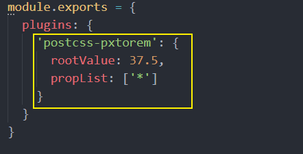

## 处理后端返回数据中的大整数问题

后端返回的数据一般都是 JSON 格式的字符串。

```json
'{ "id": 9007199254740995, "name": "Jack", "age": 18 }'
```

axios 为了方便我们使用数据，它会在内部使用 `JSON.parse()` 把后端返回的数据转为 JavaScript 对象。

```javascript
// { id: 9007199254740996, name: 'Jack', age: 18 }
JSON.parse('{ "id": 9007199254740995, "name": "Jack", "age": 18 }')
```

可以看到，超出安全整数范围的 id 无法精确表示，这个问题并不是 axios 的错。

JavaScript 能够准确表示的整数范围在`-2^53`到`2^53`之间（不含两个端点），超过这个范围，无法精确表示这个值，这使得 JavaScript 不适合进行科学和金融方面的精确计算。

```javascript
Math.pow(2, 53) // 9007199254740992

9007199254740992  // 9007199254740992
9007199254740993  // 9007199254740992

Math.pow(2, 53) === Math.pow(2, 53) + 1
// true
```

上面代码中，超出 2 的 53 次方之后，一个数就不精确了。
ES6 引入了`Number.MAX_SAFE_INTEGER`和`Number.MIN_SAFE_INTEGER`这两个常量，用来表示这个范围的上下限。

```javascript
Number.MAX_SAFE_INTEGER === Math.pow(2, 53) - 1
// true
Number.MAX_SAFE_INTEGER === 9007199254740991
// true

Number.MIN_SAFE_INTEGER === -Number.MAX_SAFE_INTEGER
// true
Number.MIN_SAFE_INTEGER === -9007199254740991
// true
```

上面代码中，可以看到 JavaScript 能够精确表示的极限。


了解了什么是大整数的概念，接下来的问题是如何解决？

[json-bigint](https://github.com/sidorares/json-bigint) 是一个第三方包，它可以帮我们很好的处理这个问题。

使用它的第一步就是把它安装到你的项目中。

```shell
npm i json-bigint
```

下面是使用它的一个简单示例。

```javascript
import JSONbig from 'json-bigint'

var jsonStr = '{ "value" : 9223372036854775807, "v2": 123 }';

// {value: 9223372036854776000, v2: 123}
JSON.parse(jsonStr)

// 看下面的截图输出
const ret = JSONbig.parse(jsonStr)

// 使用它的时候要 toString
console.log(ret.value.toString()) // '9223372036854775807'
```


> json-bigint 会把超出 JS 安全整数范围的数字转为一个 BigNumber 类型的对象，对象数据是它内部的一个算法处理之后的，我们要做的就是在使用的时候转为字符串来使用。


通过 Axios 请求得到的数据都是 Axios 处理（JSON.parse）之后的，我们应该在 Axios 执行处理之前手动使用 json-bigint 来解析处理。Axios 提供了自定义处理原始后端返回数据的 API：`transformResponse` 。

```javascript
import axios from 'axios'

import jsonBig from 'json-bigint'

var json = '{ "value" : 9223372036854775807, "v2": 123 }'

console.log(jsonBig.parse(json))

const request = axios.create({
  baseURL: 'http://ttapi.research.itcast.cn/', // 接口基础路径

  // transformResponse 允许自定义原始的响应数据（字符串）
  transformResponse: [function (data) {
    try {
      // 如果转换成功则返回转换的数据结果
      return jsonBig.parse(data)
    } catch (err) {
      // 如果转换失败，则包装为统一数据格式并返回
      return {
        data
      }
    }
  }]
})

export default request

```

### 扩展：ES2020 BigInt
[ES2020](https://github.com/tc39/proposal-bigint) 引入了一种新的数据类型 BigInt（大整数），来解决这个问题。BigInt 只用来表示整数，没有位数的限制，任何位数的整数都可以精确表示。

参考链接：

- [https://developer.mozilla.org/zh-CN/docs/Web/JavaScript/Reference/Global_Objects/BigInt](https://developer.mozilla.org/zh-CN/docs/Web/JavaScript/Reference/Global_Objects/BigInt)
- [http://es6.ruanyifeng.com/#docs/number#BigInt-%E6%95%B0%E6%8D%AE%E7%B1%BB%E5%9E%8B](http://es6.ruanyifeng.com/#docs/number#BigInt-%E6%95%B0%E6%8D%AE%E7%B1%BB%E5%9E%8B)

## 关于 `.postcssrc.js` 配置文件

```js
module.exports = {
  plugins: {
    'autoprefixer': {
      browsers: ['Android >= 4.0', 'iOS >= 8']
    },
    'postcss-pxtorem': {
      rootValue: 37.5,
      propList: ['*']
    }
  }
}

```

`.postcssrc.js` 是 PostCSS 的配置文件。

### PostCSS 介绍

[PostCSS](https://postcss.org/) 是一个处理 CSS 的编译工具，本身功能比较单一，它主要负责解析 CSS 代码，再交由插件来进行处理，它的插件体系非常强大，所能进行的操作是多种多样的，例如：

- [Autoprefixer](https://github.com/postcss/autoprefixer) 插件可以实现自动添加浏览器相关的声明前缀
- [PostCSS Preset Env](https://github.com/csstools/postcss-preset-env) 插件可以让你使用更新的 CSS 语法特性并实现向下兼容
- [postcss-pxtorem](https://github.com/cuth/postcss-pxtorem) 可以实现将 px 转换为 rem
- ...

目前 PostCSS 已经有 [200 多个功能各异的插件](https://github.com/postcss/postcss/blob/master/docs/plugins.md)。开发人员也可以根据项目的需要，开发出自己的 PostCSS 插件。


PostCSS 一般不单独使用，而是与已有的构建工具进行集成。

[Vue CLI 默认配置了 PostCSS](https://cli.vuejs.org/zh/guide/css.html#postcss)，并且默认开启了 [autoprefixer](https://github.com/postcss/autoprefixer) 插件。

> Vue CLI 内部使用了 PostCSS。
>
> 你可以通过 `.postcssrc` 或任何 [postcss-load-config](https://github.com/michael-ciniawsky/postcss-load-config) 支持的配置源来配置 PostCSS。也可以通过 `vue.config.js` 中的 `css.loaderOptions.postcss` 配置 [postcss-loader](https://github.com/postcss/postcss-loader)。
>
> 我们默认开启了 [autoprefixer](https://github.com/postcss/autoprefixer)。如果要配置目标浏览器，可使用 `package.json` 的 [browserslist](https://cli.vuejs.org/zh/guide/browser-compatibility.html#browserslist) 字段。


### Autoprefixer 插件的配置


[autoprefixer](https://github.com/postcss/autoprefixer) 是一个自动添加浏览器前缀的 PostCss 插件，`browsers` 用来配置兼容的浏览器版本信息，但是写在这里的话会引起编译器警告。

```
Replace Autoprefixer browsers option to Browserslist config.
Use browserslist key in package.json or .browserslistrc file.

Using browsers option can cause errors. Browserslist config
can be used for Babel, Autoprefixer, postcss-normalize and other tools.

If you really need to use option, rename it to overrideBrowserslist.

Learn more at:
https://github.com/browserslist/browserslist#readme
https://twitter.com/browserslist
```

警告意思就是说你应该将 `browsers` 选项写到 `package.json` 或 `.browserlistrc` 文件中。

```
[Android]
>= 4.0

[iOS]
>= 8

```

> 具体语法请[参考这里](https://github.com/browserslist/browserslist)。


### postcss-pxtorem 插件的配置



- `rootValue`：表示根元素字体大小，它会根据根元素大小进行单位转换
- `propList` 用来设定可以从 px 转为 rem 的属性
  - 例如 `*` 就是所有属性都要转换，`width` 就是仅转换 `width` 属性


`rootValue` 应该如何设置呢？

```
如果你使用的是基于 lib-flexable 的 REM 适配方案，则应该设置为你的设计稿的十分之一。
例如设计稿是 750 宽，则应该设置为 75。
```


大多数设计稿的原型都是以 iphone6 为原型，iphone6 设备的宽是 750，我们的设计稿也是这样。

但是 Vant 建议设置为 37.5，为什么呢？

```
因为 Vant 是基于 375 写的，所以如果你设置为 75 的话，Vant 的样式就小了一半。
```

所以如果设置为 `37.5` 的话，Vant 的样式是没有问题的，但是我们在测量设计稿的时候都必须除2才能使用，否则就会变得很大。


这样做其实也没有问题，但是有没有更好的办法呢？我就想实现测量多少写多少（不用换算）。于是聪明的你就想，可以不可以这样来做？

- 如果是 Vant 的样式，就把 `rootValue` 设置为 37.5 来转换
- 如果是我们的样式，就按照 75 的 `rootValue` 来转换


通过[查阅文档](https://github.com/cuth/postcss-pxtorem#options)我们可以看到 `rootValue` 支持两种参数类型：

- 数字：固定值
- 函数：动态计算返回
  - 有一个默认参数：一个对象，其中包含一个 file 属性（编译的文件路径）

所以我们修改配置如下：

```js
module.exports = {
  plugins: {
    'postcss-pxtorem': {
      rootValue: ({ file }) => {
        return file.name.includes('vant') ? 37.5 : 75
      },
      propList: ['*']
    }
  }
}

```

配置完毕，把服务重启一下，最后测试，very good。


总结一下：

- PostCSS 是一个处理 CSS 的工具，它的插件功能非常强大
- `.postcssrc.js` 是 PostCss 的配置文件
- [Vue CLI 默认配置了 PostCSS](https://cli.vuejs.org/zh/guide/css.html#postcss)，并且默认开启了 [autoprefixer](https://github.com/postcss/autoprefixer) 插件。
- 项目中安装的 [postcss-pxtorem](https://github.com/cuth/postcss-pxtorem) 是 PostCss 的一个插件，用来将 CSS 中的 px 转为 rem
  - 该插件的 `rootValue` 属性非常重要，如果使用的是 [lib-flexable]() 的 REM 适配方案就要设置为你的设计稿的十分之一；如果你的设计稿和第三方 UI 组件库不一致，也可以动态调整。

## 初始目录结构说明

项目创建好以后，下面我们来了解一下目录结构的含义：

```
.
├── .browserslistrc
├── .editorconfig
├── .eslintrc.js
├── .gitignore
├── README.md
├── babel.config.js
├── package-lock.json
├── package.json
├── public
│   ├── favicon.ico
│   └── index.html
└── src
    ├── App.vue     根组件
    ├── assets      资源目录
    ├── components  公共组件
    ├── main.js     入口模块
    ├── router      路由
    ├── store       Vuex 容器
    └── views       路由组件
```