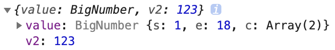

## 处理后端返回数据中的大整数问题

JavaScript 能够准确表示的整数范围在`-2^53`到`2^53`之间（不含两个端点），超过这个范围，无法精确表示这个值，这使得 JavaScript 不适合进行科学和金融方面的精确计算。

```javascript
Math.pow(2, 53) // 9007199254740992

9007199254740992  // 9007199254740992
9007199254740993  // 9007199254740992

Math.pow(2, 53) === Math.pow(2, 53) + 1
// true
```

上面代码中，超出 2 的 53 次方之后，一个数就不精确了。
ES6 引入了`Number.MAX_SAFE_INTEGER`和`Number.MIN_SAFE_INTEGER`这两个常量，用来表示这个范围的上下限。

```javascript
Number.MAX_SAFE_INTEGER === Math.pow(2, 53) - 1
// true
Number.MAX_SAFE_INTEGER === 9007199254740991
// true

Number.MIN_SAFE_INTEGER === -Number.MAX_SAFE_INTEGER
// true
Number.MIN_SAFE_INTEGER === -9007199254740991
// true
```

上面代码中，可以看到 JavaScript 能够精确表示的极限。

后端返回的数据一般都是 **JSON 格式的字符串**。

```json
'{ "id": 9007199254740995, "name": "Jack", "age": 18 }'
```

如果这个字符不做任何处理，你能方便的获取到字符串中的指定数据吗？非常麻烦。所以我们要把它转换为 JavaScript 对象来使用就很方便了。

幸运的是 axios 为了方便我们使用数据，它会在内部使用 `JSON.parse()` 把后端返回的数据转为 JavaScript 对象。

```javascript
// { id: 9007199254740996, name: 'Jack', age: 18 }
JSON.parse('{ "id": 9007199254740995, "name": "Jack", "age": 18 }')
```

可以看到，超出安全整数范围的 id 无法精确表示，这个问题并不是 axios 的错。

了解了什么是大整数的概念，接下来的问题是如何解决？

[json-bigint](https://github.com/sidorares/json-bigint) 是一个第三方包，它可以帮我们很好的处理这个问题。

使用它的第一步就是把它安装到你的项目中。

```shell
npm i json-bigint
```

下面是使用它的一个简单示例。

```javascript
import JSONbig from 'json-bigint'

var jsonStr = '{ "value" : 9223372036854775807, "v2": 123 }';

// {value: 9223372036854776000, v2: 123}
JSON.parse(jsonStr)

// 看下面的截图输出
const ret = JSONbig.parse(jsonStr)

// 使用它的时候要 toString
console.log(ret.value.toString()) // '9223372036854775807'
```


> json-bigint 会把超出 JS 安全整数范围的数字转为一个 BigNumber 类型的对象，对象数据是它内部的一个算法处理之后的，我们要做的就是在使用的时候转为字符串来使用。


通过 Axios 请求得到的数据都是 Axios 处理（JSON.parse）之后的，我们应该在 Axios 执行处理之前手动使用 json-bigint 来解析处理。Axios 提供了自定义处理原始后端返回数据的 API：`transformResponse` 。

```javascript
import axios from 'axios'

import jsonBig from 'json-bigint'

var json = '{ "value" : 9223372036854775807, "v2": 123 }'

console.log(jsonBig.parse(json))

const request = axios.create({
  baseURL: 'http://ttapi.research.itcast.cn/', // 接口基础路径

  // transformResponse 允许自定义原始的响应数据（字符串）
  transformResponse: [function (data) {
    try {
      // 如果转换成功则返回转换的数据结果
      return jsonBig.parse(data)
    } catch (err) {
      // 如果转换失败，则包装为统一数据格式并返回
      return {
        data
      }
    }
  }]
})

export default request

```

### 扩展：ES2020 BigInt
[ES2020](https://github.com/tc39/proposal-bigint) 引入了一种新的数据类型 BigInt（大整数），来解决这个问题。BigInt 只用来表示整数，没有位数的限制，任何位数的整数都可以精确表示。

参考链接：

- [https://developer.mozilla.org/zh-CN/docs/Web/JavaScript/Reference/Global_Objects/BigInt](https://developer.mozilla.org/zh-CN/docs/Web/JavaScript/Reference/Global_Objects/BigInt)
- [http://es6.ruanyifeng.com/#docs/number#BigInt-%E6%95%B0%E6%8D%AE%E7%B1%BB%E5%9E%8B](http://es6.ruanyifeng.com/#docs/number#BigInt-%E6%95%B0%E6%8D%AE%E7%B1%BB%E5%9E%8B)

## 关于 `.postcssrc.js` 配置文件

```js
module.exports = {
  plugins: {
    'autoprefixer': {
      browsers: ['Android >= 4.0', 'iOS >= 8']
    },
    'postcss-pxtorem': {
      rootValue: 37.5,
      propList: ['*']
    }
  }
}

```

`.postcssrc.js` 是 PostCSS 的配置文件。

### PostCSS 介绍

[PostCSS](https://postcss.org/) 是一个处理 CSS 的编译工具，本身功能比较单一，它主要负责解析 CSS 代码，再交由插件来进行处理，它的插件体系非常强大，所能进行的操作是多种多样的，例如：

- [Autoprefixer](https://github.com/postcss/autoprefixer) 插件可以实现自动添加浏览器相关的声明前缀
- [PostCSS Preset Env](https://github.com/csstools/postcss-preset-env) 插件可以让你使用更新的 CSS 语法特性并实现向下兼容
- [postcss-pxtorem](https://github.com/cuth/postcss-pxtorem) 可以实现将 px 转换为 rem
- ...

目前 PostCSS 已经有 [200 多个功能各异的插件](https://github.com/postcss/postcss/blob/master/docs/plugins.md)。开发人员也可以根据项目的需要，开发出自己的 PostCSS 插件。


PostCSS 一般不单独使用，而是与已有的构建工具进行集成。

[Vue CLI 默认配置了 PostCSS](https://cli.vuejs.org/zh/guide/css.html#postcss)，并且默认开启了 [autoprefixer](https://github.com/postcss/autoprefixer) 插件。

> Vue CLI 内部使用了 PostCSS。
>
> 你可以通过 `.postcssrc` 或任何 [postcss-load-config](https://github.com/michael-ciniawsky/postcss-load-config) 支持的配置源来配置 PostCSS。也可以通过 `vue.config.js` 中的 `css.loaderOptions.postcss` 配置 [postcss-loader](https://github.com/postcss/postcss-loader)。
>
> 我们默认开启了 [autoprefixer](https://github.com/postcss/autoprefixer)。如果要配置目标浏览器，可使用 `package.json` 的 [browserslist](https://cli.vuejs.org/zh/guide/browser-compatibility.html#browserslist) 字段。


### Autoprefixer 插件的配置


[autoprefixer](https://github.com/postcss/autoprefixer) 是一个自动添加浏览器前缀的 PostCss 插件，`browsers` 用来配置兼容的浏览器版本信息，但是写在这里的话会引起编译器警告。

```
Replace Autoprefixer browsers option to Browserslist config.
Use browserslist key in package.json or .browserslistrc file.

Using browsers option can cause errors. Browserslist config
can be used for Babel, Autoprefixer, postcss-normalize and other tools.

If you really need to use option, rename it to overrideBrowserslist.

Learn more at:
https://github.com/browserslist/browserslist#readme
https://twitter.com/browserslist
```

警告意思就是说你应该将 `browsers` 选项写到 `package.json` 或 `.browserlistrc` 文件中。

```
[Android]
>= 4.0

[iOS]
>= 8

```

> 具体语法请[参考这里](https://github.com/browserslist/browserslist)。


### postcss-pxtorem 插件的配置


- `rootValue`：表示根元素字体大小，它会根据根元素大小进行单位转换
- `propList` 用来设定可以从 px 转为 rem 的属性
  - 例如 `*` 就是所有属性都要转换，`width` 就是仅转换 `width` 属性


`rootValue` 应该如何设置呢？

```
如果你使用的是基于 lib-flexable 的 REM 适配方案，则应该设置为你的设计稿的十分之一。
例如设计稿是 750 宽，则应该设置为 75。
```


大多数设计稿的原型都是以 iphone6 为原型，iphone6 设备的宽是 750，我们的设计稿也是这样。

但是 Vant 建议设置为 37.5，为什么呢？

```
因为 Vant 是基于 375 写的，所以如果你设置为 75 的话，Vant 的样式就小了一半。
```

所以如果设置为 `37.5` 的话，Vant 的样式是没有问题的，但是我们在测量设计稿的时候都必须除2才能使用，否则就会变得很大。


这样做其实也没有问题，但是有没有更好的办法呢？我就想实现测量多少写多少（不用换算）。于是聪明的你就想，可以不可以这样来做？

- 如果是 Vant 的样式，就把 `rootValue` 设置为 37.5 来转换
- 如果是我们的样式，就按照 75 的 `rootValue` 来转换


通过[查阅文档](https://github.com/cuth/postcss-pxtorem#options)我们可以看到 `rootValue` 支持两种参数类型：

- 数字：固定值
- 函数：动态计算返回
  - 有一个默认参数：一个对象，其中包含一个 file 属性（编译的文件路径）

所以我们修改配置如下：

```js
module.exports = {
  plugins: {
    'postcss-pxtorem': {
      rootValue: ({ file }) => {
        return file.name.includes('vant') ? 37.5 : 75
      },
      propList: ['*']
    }
  }
}

```

配置完毕，把服务重启一下，最后测试，very good。


总结一下：

- PostCSS 是一个处理 CSS 的工具，它的插件功能非常强大
- `.postcssrc.js` 是 PostCss 的配置文件
- [Vue CLI 默认配置了 PostCSS](https://cli.vuejs.org/zh/guide/css.html#postcss)，并且默认开启了 [autoprefixer](https://github.com/postcss/autoprefixer) 插件。
- 项目中安装的 [postcss-pxtorem](https://github.com/cuth/postcss-pxtorem) 是 PostCss 的一个插件，用来将 CSS 中的 px 转为 rem
  - 该插件的 `rootValue` 属性非常重要，如果使用的是 [lib-flexable]() 的 REM 适配方案就要设置为你的设计稿的十分之一；如果你的设计稿和第三方 UI 组件库不一致，也可以动态调整。

## 初始目录结构说明

项目创建好以后，下面我们来了解一下目录结构的含义：

```
.
├── .browserslistrc
├── .editorconfig
├── .eslintrc.js
├── .gitignore
├── README.md
├── babel.config.js
├── package-lock.json
├── package.json
├── public
│   ├── favicon.ico
│   └── index.html
└── src
    ├── App.vue     根组件
    ├── assets      资源目录
    ├── components  公共组件
    ├── main.js     入口模块
    ├── router      路由
    ├── store       Vuex 容器
    └── views       路由组件
```

## 记住列表滚动的位置

思路：

- 监听文章列表的滚动事件，将当前滚动位置记录起来
- 当切换频道的时候将之前记录的滚动位置设置回去

一、设置滚动容器

```less
.van-tabs__content {
  // 响应式布局单位：vw 和 vh
  // vw: 1vw = 布局视口宽度的1%
  // vh: 1vh = 布局视口高度的1%
  height: 79vh;
  overflow-y: auto;
}
```

测试：

```js
// 获取滚动的位置
DOM元素.scrollTop

// 设置滚动的位置
DOM元素.scrollTop = xxx
```


二、监听滚动事件

1、安装 lodash

```shell
npm i lodash
```

2、加载函数防抖处理函数

```js
import { debounce } from 'lodash'
```

3、在 mounted 中获取监听滚动容器的滚动事件

```js
mounted () {
  // debounce 函数防抖
  //    参数1：函数
  //    参数2：事件，单位是毫秒
  //    返回值：返回经过防抖处理的函数
  const articleScrollWrap = this.$refs['article-list-wrap']
  articleScrollWrap.onscroll = debounce(() => {
		console.log('onScroll')
  }, 50)
},
```


三、记录并设置滚动位置

1、在滚动事件处理函数中记录滚动的位置

```js
mounted () {
  // debounce 函数防抖
  //    参数1：函数
  //    参数2：事件，单位是毫秒
  //    返回值：返回经过防抖处理的函数
  const articleScrollWrap = this.articleScrollWrap
  articleScrollWrap.onscroll = debounce(() => {
    this.channels[this.active].scrollTop = articleScrollWrap.scrollTop
  }, 50)
},
```

2、当标签页切换的时候设置滚动容器的滚动位置

```html
<van-tabs change="onTabChange">
  ...
</van-tabs>
```

```js
onTabChange () {
  const scrollTop = this.channels[this.active].scrollTop
  if (scrollTop) {
    this.$nextTick(() => {
      this.articleScrollWrap.scrollTop = scrollTop
    })
    // this.articleScrollWrap.scrollTop = scrollTop
  }
}
```


四、关于 [$nextTick](https://cn.vuejs.org/v2/api/#vm-nextTick) 方法的作用

```html
<!DOCTYPE html>
<html lang="en">
<head>
  <meta charset="UTF-8">
  <meta name="viewport" content="width=device-width, initial-scale=1.0">
  <title>Document</title>
</head>
<body>
  <div id="app">
    <h1>关于 $nextTick() 的说明</h1>
    <p ref="p">{{ message }}</p>
    <button @click="changeMessage">改变 message</button>
  </div>
  <script src="./node_modules/vue/dist/vue.js"></script>
  <script>
    new Vue({
      el: '#app',
      data: {
        message: 'Hello World'
      },
      methods: {
        changeMessage () {
          // 数据驱动视图：当数据改变会影响视图更新
          // 但是这更新DOM这件事儿不是立即的
          this.message = '你好，世界'
          
          // console.log(this.$refs.p.innerHTML)

          // 如果你需要在数据改变之后立即操作受数据影响影响的视图 DOM
          // 最好放到 nextTick 函数中来执行，这样确保是没有问题的
          this.$nextTick(() => {
            console.log(this.$refs.p.innerHTML)
          })
        }
      }
    })
  </script>
</body>
</html>

```

## 扩展：函数防抖和函数节流

干嘛的？限制函数调用的频率。

为什么要限制？例如搜索的时候请求联想建议，没必要每次内容改变就发请求，当用户输入的很快的时候，中间的请求都是无意义的，浪费资源，没必要。

### 函数防抖（Debounce）

**概念：** `在事件被触发n秒后再执行，如果在这n秒内又被触发，则重新计时。`

**生活中的实例：** `如果有人进电梯（触发事件），那电梯将在10秒钟后出发（执行事件监听器），这时如果又有人进电梯了（在10秒内再次触发该事件），我们又得等10秒再出发（重新计时）。`

我们先使用第三方包 [lodash]() 来体验什么是函数防抖：

首先把 lodash 安装到项目中：

```sh
# yarn add lodash
npm i lodash
```

示例：

```html
<!DOCTYPE html>
<html lang="en">
  <head>
    <meta charset="UTF-8" />
    <meta name="viewport" content="width=device-width, initial-scale=1.0" />
    <meta http-equiv="X-UA-Compatible" content="ie=edge" />
    <title>Document</title>
  </head>
  <body>
    <script src="./node_modules/lodash/lodash.js"></script>
    <script>
      // lodash 会在全局提供一个成员：_

      // _ 对象中有很多方法，其中有一个方法专门用于处理函数防抖
      // 方法名：debounce
      // 作用：函数防抖
      // 使用方式：

      function fn(foo) {
        console.log("hello", foo);
      }

      // 正常的函数调用：立即调用，而且是一定会调用
      // fn()
      // fn()
      // fn()

      // 我们可以使用函数防抖把一个正常的函数变得不正常
      // 两个参数：
      //   参数1：函数
      //   参数2：时间，单位是毫秒
      // 返回值：函数
      //   返回值函数的功能和 fn 和的功能是一样
      //   唯一的区别就是经过了防抖处理
      const newFn = _.debounce(fn, 1000);

      // 计时 1s
      newFn("a");

      // 当你不到 1s 的时候，再次调用
      // 先把之前的废掉，重新计时 1s
      newFn("b");

      newFn("b");
      newFn("b");
      // newFn()

      // he
    </script>
  </body>
</html>
```

### 函数防抖实现原理

函数防抖的实现原理：

```js
function fn(foo) {
  console.log("hello", foo);
}

const newFn = debounce(fn, 1000);

// 计时 1s
newFn(123);

// 如果在 1s 之内重新调用
//   先把之前的废除
//   重新计时
newFn("world");
// newFn()

function debounce(callback, time) {
  let timer = null;
  // 函数参数中的 ... 表示接收剩余参数
  // 它会把所有的参数收集到一个数组中
  return function(...args) {
    console.log(args);
    window.clearTimeout(timer);
    timer = setTimeout(() => {
      // 这里的 ... 表示数组展示操作符
      // args[0], args[1], args[2] .........
      callback(...args);
    }, time);
  };
}
```

### 函数节流（Throttle）

**概念：** `规定一个单位时间，在这个单位时间内，只能有一次触发事件的回调函数执行，如果在同一个单位时间内某事件被触发多次，只有一次能生效。`

生活中的例子：`函数节流就是开枪游戏的射速，就算一直按着鼠标射击，也只会在规定射速内射出子弹。`

我们先用 lodash 来体验节流的使用方式：

```js
function fn() {
  console.log("------ fire ------");
}

// 参数1：函数
// 参数2：间隔时间
// 返回值：函数（它的功能和保证的 fn 的功能是一样的，但是被进行了节流处理）
// 第1次直接调用，之后的按照一定频率进行调用
const newFn = _.throttle(fn, 2000);

// newFn()
// newFn()

setInterval(() => {
  console.log("鼠标点击");
  newFn();
}, 200);

// 一上来就调用一次
// newFn()

// // 之后的调用，开始计时 1s
// newFn()

// // 1s 之内所有的调用只有1次
// newFn()
// newFn()
// newFn()
// newFn()
// newFn()
```

### 函数节流实现原理

```js
function throttle(callback, interval) {
  // 最后一次的调用时间
  let lastTime = 0;

  // 定时器
  let timer = null;

  // 返回一个函数
  return function() {
    // 清除定时器
    clearTimeout(timer);

    // 当前最新时间
    let nowTime = Date.now();

    // 如果当前最新时间 - 上一次时间 >= 时间间隔
    // 或者没有上一次时间，那就立即调用
    if (nowTime - lastTime >= interval) {
      callback();

      // 记录最后一次的调用时间
      // 1
      lastTime = nowTime;
    } else {
      timer = setTimeout(() => {
        callback();
      }, interval);
    }
  };
}

const fn = throttle(函数, 1000);

//
fn();

fn();

fn();
```

### 函数节流或者防抖的相关场景

- 建议
- window.resize 事件处理
- 页面的滚动事件

### 总结

- 函数防抖和函数节流都是防止某一时间频繁触发，但是这两兄弟之间的特性却不一样。
  - search 搜索联想，用户在不断输入值时，用防抖来节约请求资源。
  - window 触发 resize 的时候，不断的调整浏览器窗口大小会不断的触发这个事件，用防抖来让其只触发一次
- 函数防抖是某一段时间内只执行一次，而函数节流是间隔时间执行。
  - 鼠标不断点击触发，mousedown(单位时间内只触发一次)
  - 监听滚动事件，比如是否滑到底部自动加载更多，用 throttle 来判断

## 扩展：lodash 函数库

lodash 是一个常用工具函数库，它里面封装了好多常用的工具函数：

- 官方文档： https://lodash.com/
- 翻译的中文文档：https://www.lodashjs.com/

> 在 lodash 之前还有一个 JavaScript 工具函数库：[underscore](https://underscorejs.org/)，lodash 模仿 underscope 自己重新实现了一遍，它相比 underscore 最大的好处是它支持按需加载。
>
> underscope 不支持按需加载。

### 记住列表的滚动位置

为什么列表滚动会相互影响？

```
因为它们并不是在自己内部滚动，而是整个 body 页面在滚动。无论你是在 a 频道还是在 b 频道，其实滚动的都是 body 元素。
```

> 这里分享一个小技巧：如何快速找到是哪个元素产生的滚动？
>
> 把下面的代码粘贴到调试工具中运行一下，然后滚动页面，就可以看到是哪个元素产生的滚动了。
>
> ```js
> function findScroller(element) {
> element.onscroll = function() { console.log(element) }
> 
> Array.from(element.children).forEach(findScroller)
> }
> 
> findScroller(document.body)
> ```
>
> Sensei, Sensei 你咋知道的呀？
>
> 其实这个问题也困扰了我很久，在某个夜黑风高的晚上我 Google 到的，请食用：https://stackoverflow.com/questions/19095964/how-to-know-which-html-element-is-causing-vertical-scroll-bar


怎么解决？

```
让每一个标签内容文章列表产生自己的滚动容器，这样就不会相互影响了。
```


如何让标签内容文章列表产生自己的滚动容器？

- 固定高度：`height: xxx;`
- 溢出滚动：`overflow-y: auto;`


然后我们给文章列表组件的根节点样式设置如下：

```
.article-list {
	height: 100%;
  overflow-y: auto;
}
```


但是我们发现设置高 `100%` 的话没有作用，这是为什么？

```
因为百分比是相对于父元素，而我们通过审查元素发现它所有的父元素都没有高，那肯定没有作用了。
```


难道我们为了让这个子元素高度百分百，就一个一个的把所有的父元素都设置高百分百吗？虽然可以，但是这样也太麻烦了。


当当当当：CSS3 中新增了一种视口单位 `vw` 和 `vh`，何谓视口，就是根据你浏览器窗口的大小的单位，**不受父元素影响**。

> PS：在移动端，视口单位相对于布局视口。

- 1vw = 可视窗口宽度的百分之一，比如窗口宽度是 750，则 1vw = 7.5px
- 1vh = 可视窗口高度的百分之一 ，比如窗口高度是 667，则 1vh = 6.67px

使用它唯一需要注意的就是它的兼容性：

- 在 PC 端已兼容到 IE 9
- 在移动端 iOS 8 以上以及 Android 4.4 以上获得支持，并且在微信 x5 内核中也得到完美的全面支持

Vue 本身都只兼容到 IE 9，更何况这个视口单位了，所以放心大胆的用吧。

所以我们最终设置代码如下：

```less
.article-list {
	height: 79vh;
  overflow-y: auto;
}
```

## 图片懒加载

图片懒加载

什么是图片懒加载？

```
当打开一个有很多图片的页面时，先只加载页面上看到的图片，等滚动到页面下面时，再加载所需的图片。这就是图片懒加载。
```


它有什么作用？

```
减少或延迟请求数，缓解浏览器的压力，增强用户体验。
```


设置`lazy-load`属性来开启图片懒加载，需要搭配 [Lazyload](https://youzan.github.io/vant/#/zh-CN/lazyload) 组件使用。

`Lazyload` 是 `Vue` 指令，使用前需要对指令进行注册。

```js
import { Lazyload } from 'vant'

Vue.use(Lazyload)
```

然后给 Image 组件配置 `lazy-load` 指令属性开启懒加载

```html
<van-image
  width="100"
  height="100"
  lazy-load
  src="https://img.yzcdn.cn/vant/cat.jpeg"
/>
```

如果是普通的 img 则这样使用：

```html

```

如果是背景图，则这样使用：

> 和图片懒加载不同，背景图懒加载需要使用`v-lazy:background-image`，值设置为背景图片的地址，需要注意的是必须声明容器高度。

```html
<div  v-lazy:background-image="图片地址" />
```

更多内容请参照：[vue-lazyload 官方文档](https://github.com/hilongjw/vue-lazyload)

> 注意：如果浏览器控制台开启了 `Disable cache` 功能，则会看到每个图片出现两次请求，该问题并不影响最终结果。